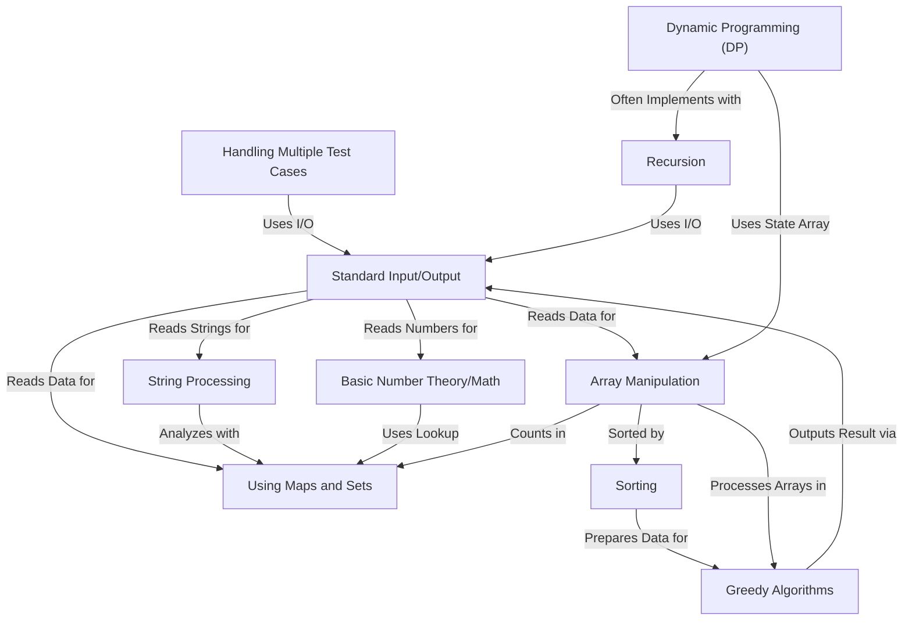
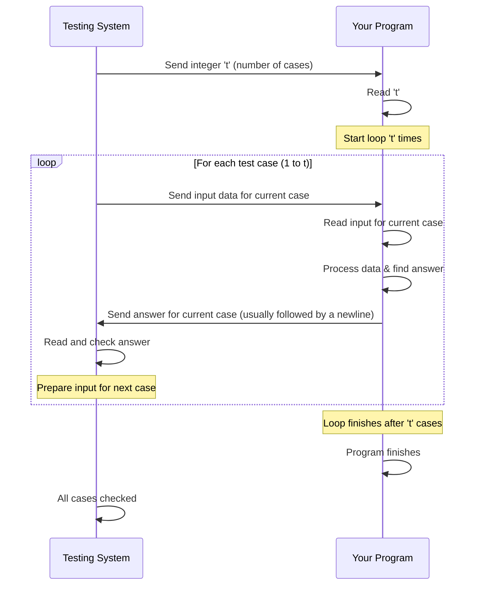
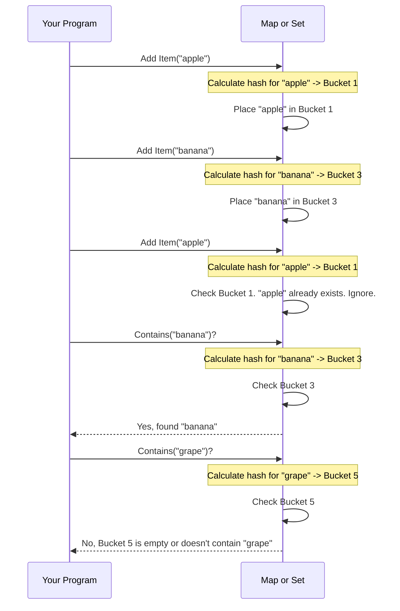
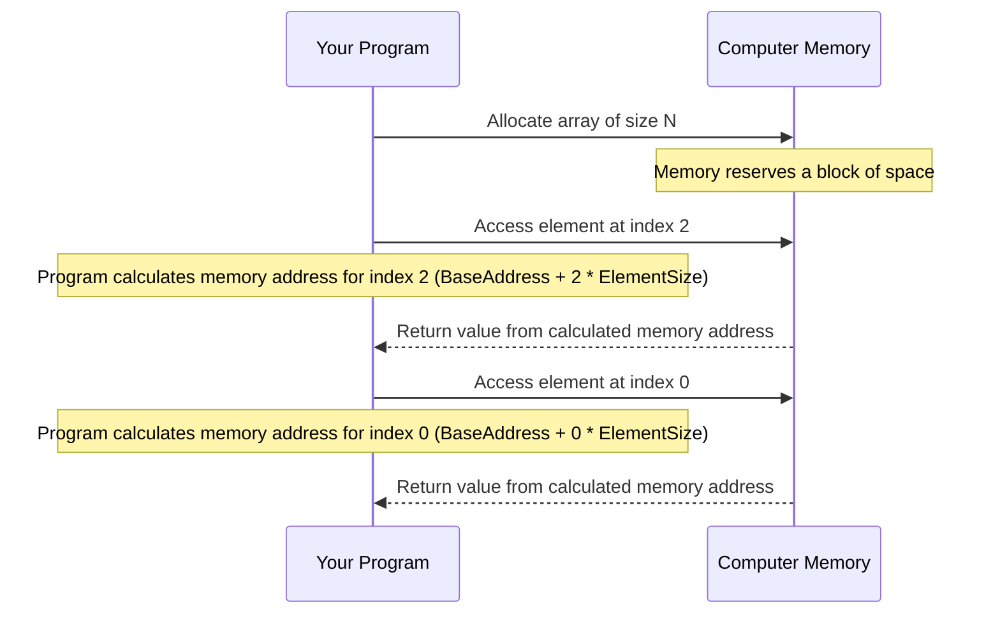
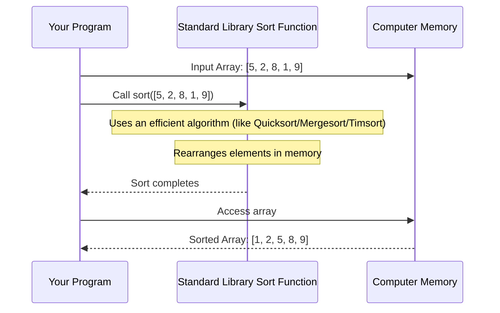
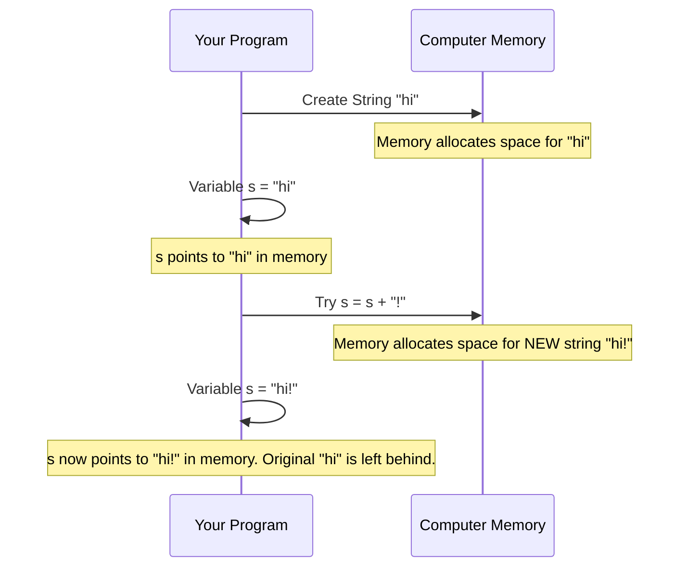
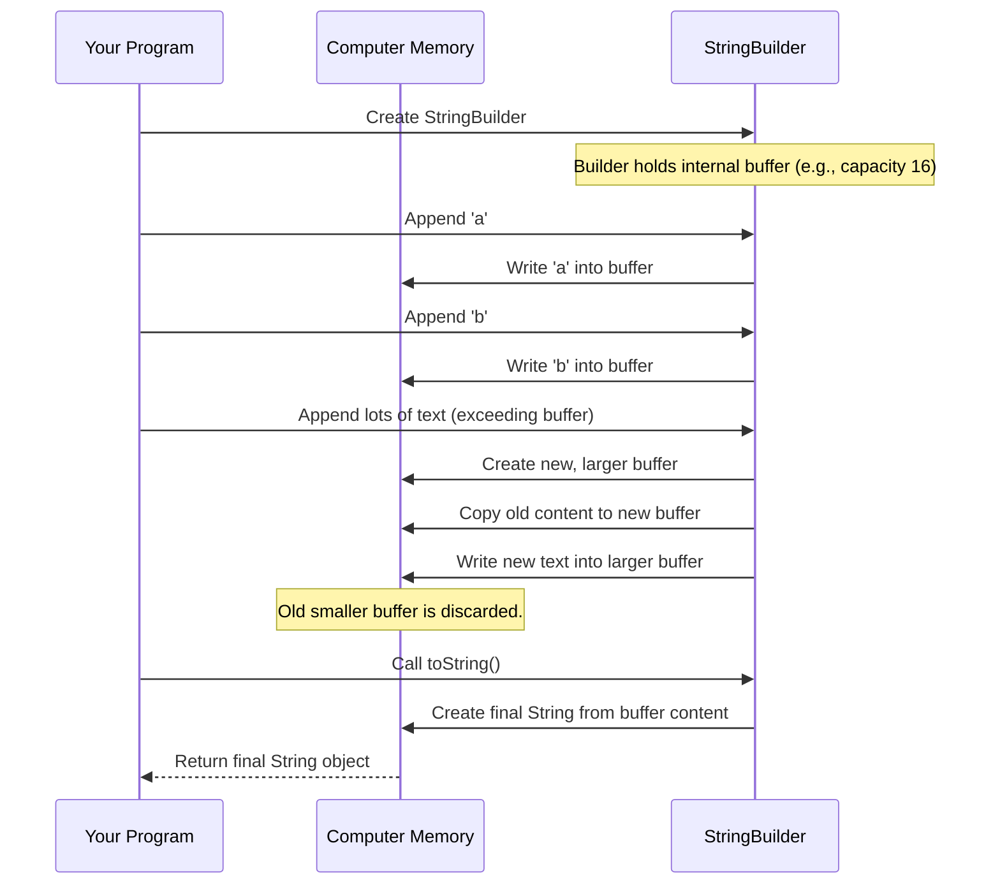
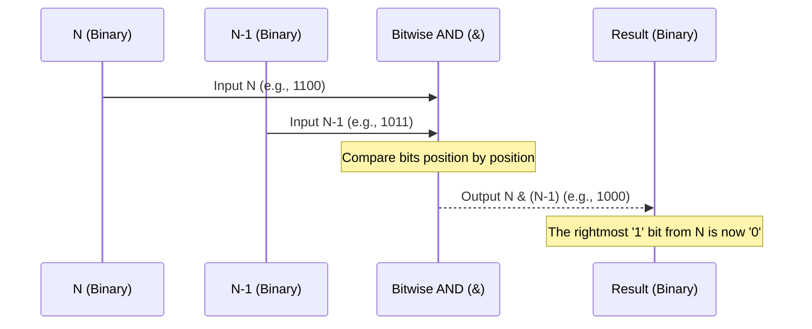
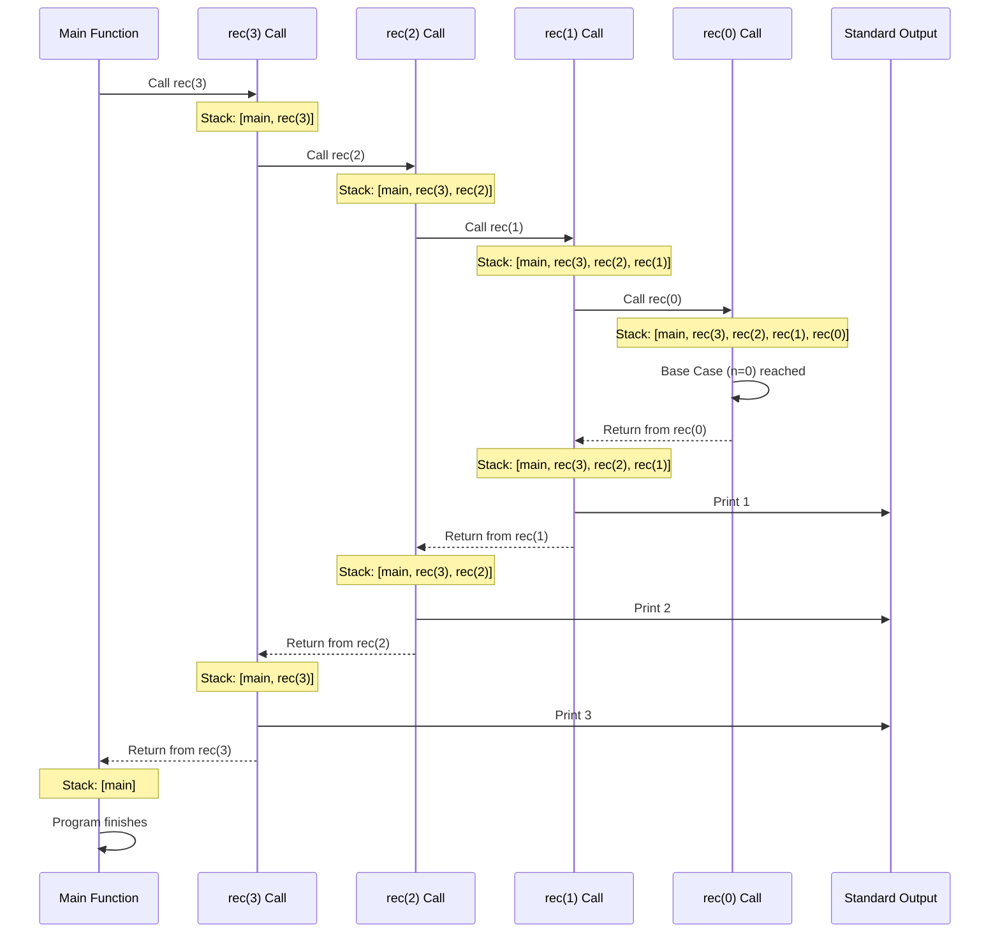
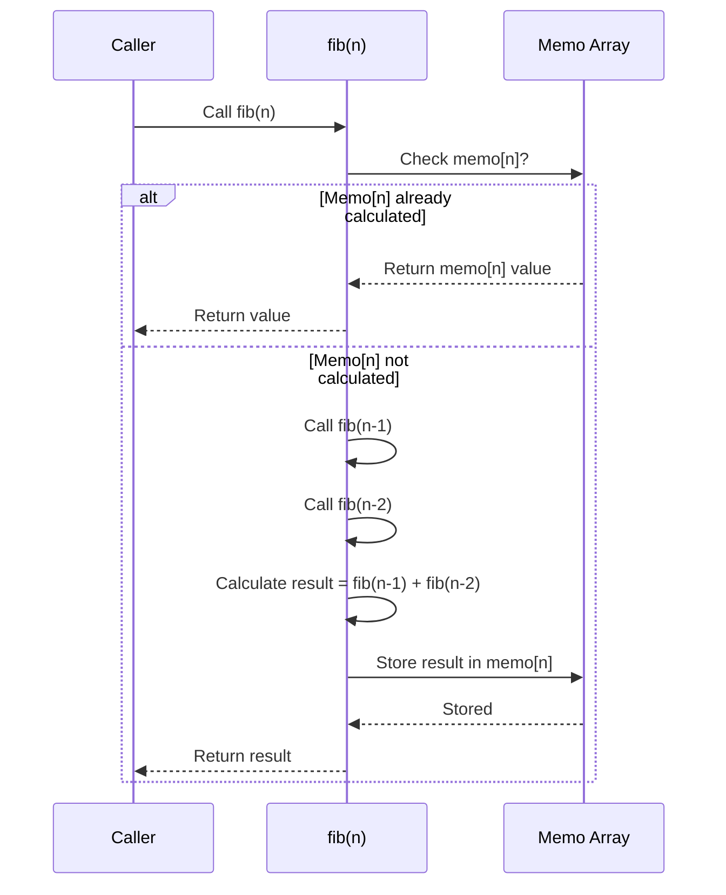

# Tutorial: CodeForces-Solutions-Templates

This project serves as a collection of **templates and solutions** for
*competitive programming problems*, primarily from Codeforces.
It demonstrates common algorithmic techniques and data structures used
to read input, process data like arrays and strings, apply methods such
as **sorting, dynamic programming, recursion, greedy algorithms**, and **number theory**,
often handling **multiple test cases**, to compute and print the final answers.


## Visual Overview



## Chapters

1. Standard Input/Output
2. Handling Multiple Test Cases
3. Using Maps and Sets
4. Array Manipulation
5. Sorting
6. String Processing
7. Basic Number Theory/Math
8. Recursion
9. Dynamic Programming (DP)
10. Greedy Algorithms


# Chapter 1: Standard Input/Output

Welcome to the first chapter of this tutorial! We're going to start with a fundamental concept that's essential for solving any problem in competitive programming: **Standard Input/Output**.

### What is Standard Input/Output?

Imagine you're taking an exam. The teacher gives you a paper with questions (the input) and you write your answers on that same paper (the output).

In programming, especially in competitive programming, your program acts like you during the exam. It needs to read the data provided by the problem (the input) and then print the answer it calculates (the output).

Standard Input and Standard Output are the default channels through which your program communicates with the "outside world" – usually, this is the testing system that will run your code.

*   **Standard Input:** This is where your program expects to receive data. The testing system will feed the problem's input data into this channel.
*   **Standard Output:** This is where your program should send its answer. The testing system will read from this channel to check if your answer is correct.

So, the core use case is simple: **Read the problem's data and print the correct answer.**

### How to Use Standard Input/Output

Different programming languages have different ways to handle Standard Input/Output. We'll look at Java and Python, as they are commonly used.

#### In Java

Java typically uses the `Scanner` class to read input and `System.out.print`/`System.out.println` to write output.

Let's look at how to read different types of data:

```java
import java.util.Scanner; // Needed to use the Scanner class

public class ExampleInput {
    public static void main(String[] args) {
        // Create a Scanner object to read from Standard Input
        Scanner sc = new Scanner(System.in);

        // --- Reading different types ---

        // Read an integer
        int number = sc.nextInt();
        System.out.println("You entered the number: " + number);

        // Read a long integer
        long bigNumber = sc.nextLong();
        System.out.println("You entered the big number: " + bigNumber);

        // Read a double (decimal number)
        double decimal = sc.nextDouble();
        System.out.println("You entered the decimal: " + decimal);

        // Read a single word (token separated by whitespace)
        String word = sc.next();
        System.out.println("You entered the word: " + word);

        // To read an entire line after reading other types,
        // you might need to consume the leftover newline character.
        // sc.nextLine(); // Call this after nextInt(), nextDouble(), etc.

        // Read an entire line (until newline character)
        String line = sc.nextLine();
        System.out.println("You entered the line: " + line);

        // It's good practice to close the scanner when done
        sc.close();
    }
}
```

This code shows how to create a `Scanner` and read integers, floating-point numbers, words, and entire lines.

Now, let's see how to write output:

```java
public class ExampleOutput {
    public static void main(String[] args) {
        int x = 10;
        String name = "Alice";

        // Print a value followed by a newline
        System.out.println("Hello, world!");
        System.out.println(x);

        // Print values without a newline
        System.out.print("My name is ");
        System.out.print(name);
        System.out.print(".\n"); // Use \n for newline within print

        // Combining text and variables
        System.out.println("The number is " + x + " and the name is " + name);
    }
}
```

`System.out.println()` prints the content and then moves to the next line. `System.out.print()` prints the content but stays on the same line. You can combine strings and variables using the `+` operator.

You can see examples of `Scanner` and `System.out.println` in the provided Java files like `Contests/1013/Olympiad.java` or `Recursion/Print1toN.java`. For instance, `Recursion/Print1toN.java` uses `Scanner sc = new Scanner(System.in);` to read an integer `n = sc.nextInt();` and then `System.out.println(n);` inside the `rec` function to print numbers.

#### In Python

Python is often more concise. It uses `input()` to read a line from Standard Input and `print()` to write to Standard Output.

Let's see how to read input:

```python
# Read an entire line as a string
line = input()
print("You entered the line:", line)

# Read a line and convert it to an integer
number_str = input()
number_int = int(number_str) # Convert the string to an integer
print("You entered the number:", number_int)

# A common shortcut to read an integer directly
another_number = int(input())
print("You entered another number:", another_number)

# Reading multiple numbers on one line (space-separated)
# Example: "10 20 30"
numbers_line = input().split() # Splits the line into a list of strings: ['10', '20', '30']
# Convert each string in the list to an integer
numbers_list = list(map(int, numbers_line))
print("You entered the list of numbers:", numbers_list)

# Common shortcut for the above
nums = list(map(int, input().split()))
print("Shortcut list:", nums)

# Reading a single word
word = input() # input() reads until newline, if the input is just "hello", word will be "hello"
print("You entered the word:", word)
```

Remember that `input()` always reads a string. You need to use functions like `int()`, `float()`, etc., to convert the string to the desired data type. `split()` is useful for separating multiple values on a single line, often based on spaces.

Now, how to write output in Python:

```python
x = 10
name = "Bob"

# Print a value followed by a newline (default behavior)
print("Hello, world!")
print(x)

# Print values separated by spaces followed by a newline (default)
print("My name is", name, "and I am", x, "years old.")

# Print values without a newline at the end
print("This is the first part.", end="") # Use end="" to avoid newline
print(" This is the second part on the same line.")

# Using f-strings for easy formatting (Python 3.6+)
print(f"The number is {x} and the name is {name}")
```

`print()` in Python is very flexible. By default, it prints all arguments separated by spaces and ends with a newline. You can change the separator using the `sep` argument and the ending character(s) using the `end` argument.

You can see `input()` and `print()` used in files like `basics/waytoolong.py` and `basics/CanISquare.py`. `basics/waytoolong.py` reads `n = int(input())` and then reads multiple lines using `input()` inside a loop, finally printing results with `print(i)`. `basics/CanISquare.py` uses a more advanced `sys.stdin.read` for faster input, but the core idea is reading data into the program.

### A Simple Example Problem

Let's consider a very basic problem:

**Problem:** Read two integers, `a` and `b`, and print their sum.

**Input:**
Two integers on a single line, separated by a space.
`5 10`

**Output:**
A single integer, the sum.
`15`

Here's how you would solve this using Standard Input/Output:

**Java Solution:**

```java
import java.util.Scanner;

public class SumExample {
    public static void main(String[] args) {
        Scanner sc = new Scanner(System.in);

        // Read two integers
        int a = sc.nextInt();
        int b = sc.nextInt();

        // Calculate the sum
        int sum = a + b;

        // Print the sum
        System.out.println(sum);

        sc.close();
    }
}
```

**Explanation:**
1.  We create a `Scanner` object.
2.  We call `sc.nextInt()` twice to read the two integers provided in the input. `Scanner` automatically handles the space between them.
3.  We add the two integers.
4.  We print the result using `System.out.println()`.

**Python Solution:**

```python
# Read the line containing two space-separated integers
line = input()

# Split the line into a list of strings
numbers_str = line.split() # Example: ['5', '10']

# Convert the strings to integers
a = int(numbers_str[0]) # Get the first element '5' and convert to int 5
b = int(numbers_str[1]) # Get the second element '10' and convert to int 10

# Calculate the sum
sum = a + b

# Print the sum
print(sum)

# Alternative using map (more common in competitive programming)
# a, b = map(int, input().split())
# sum = a + b
# print(sum)
```

**Explanation:**
1.  `input()` reads the line "5 10" as a string.
2.  `split()` splits the string by whitespace, resulting in a list `['5', '10']`.
3.  We access the elements of the list (`numbers_str[0]` is '5', `numbers_str[1]` is '10') and convert them to integers using `int()`.
4.  We add the integers.
5.  We print the result using `print()`. The commented-out section shows a more common, compact way using `map`.

### Under the Hood (Simplified)

How does this reading and writing actually work? Think of Standard Input and Standard Output as pipes connecting your program to the testing environment.

sequenceDiagram
    participant TS as Testing System
    participant Prog as Your Program

    TS->>Prog: Problem Input Data (via Standard Input pipe)
    Note over TS, Prog: Your program reads from its Standard Input

    Prog->>Prog: Reads data (e.g., using Scanner or input())
    Prog->>Prog: Processes data (e.g., calculates sum)
    Prog->>TS: Calculated Answer (via Standard Output pipe)
    Note over TS, Prog: Your program writes to its Standard Output

    TS->>TS: Reads answer from Standard Output
    TS->>TS: Checks if answer is correct


The Testing System writes the input data into the Standard Input "pipe" connected to your program. Your program reads from this pipe. Once your program calculates the answer, it writes it into the Standard Output "pipe," and the Testing System reads from there to verify your solution.

It's like the teacher writing questions on one side of a whiteboard and you writing answers on the other side, without talking directly!

### Conclusion

Standard Input/Output is your program's mouth and ears in the world of competitive programming. You use it to receive the problem's challenge (input) and to give back your solution (output). We learned how to use `Scanner` and `System.out.println` in Java, and `input()` and `print()` in Python to achieve this basic communication.

Being comfortable with reading various input formats and printing output exactly as required is the first crucial step.

Now that you know how to communicate with the testing system, the next step is to handle problems that involve multiple independent test cases!

[Next Chapter: Handling Multiple Test Cases](02_handling_multiple_test_cases_.md)

---
# Chapter 2: Handling Multiple Test Cases

Welcome back! In [Chapter 1: Standard Input/Output](01_standard_input_output_.md), we learned how our programs can read data given by a problem and print the required answer. This is the fundamental way our code communicates with the testing system.

Now, let's talk about a common pattern in competitive programming problems: **Handling Multiple Test Cases**.

### What are Multiple Test Cases?

Imagine you have a tool that solves a specific puzzle. A competitive programming problem often isn't just *one* puzzle to solve, but *several* variations of the same puzzle, one after another. Your program needs to solve *each* variation correctly.

This is what multiple test cases are. The problem will give you several sets of input data, and for each set, you need to produce the corresponding output answer. It's like having multiple independent mini-problems you need to solve sequentially using the same code logic.

The structure of problems with multiple test cases usually looks like this:

1.  The first line of input contains a single integer, let's call it `t`. This `t` tells you exactly how many test cases (mini-problems) you need to solve.
2.  Then, `t` blocks of input follow. Each block contains all the data needed for one test case.
3.  For each test case input block, your program should calculate the answer and print it. The output for each test case should be printed separately, usually on a new line.

### Why Use Multiple Test Cases?

This structure allows problem setters to test your code's logic with different scenarios and edge cases without making you submit your code multiple times. It also tests your ability to write code that can correctly process independent inputs in a loop.

### How to Handle Multiple Test Cases

Since you need to solve the same kind of problem `t` times, the natural way to handle this is by using a **loop**.

Here’s the basic structure:

1.  Read the number of test cases, `t`.
2.  Start a loop that will run `t` times.
3.  **Inside the loop:**
    *   Read the input data for the current test case.
    *   Solve the problem for *only* this test case.
    *   Print the output for this test case.
    *   **Crucially:** Prepare for the *next* test case (this often involves making sure variables or data structures from the previous case don't interfere).

Let's look at the structure in Java and Python.

#### In Java

You typically use a `Scanner` (as we saw in [Chapter 1](01_standard_input_output_.md)) to read `t`, and then a `while` loop. A common pattern is `while(t-- > 0)`. This loop continues as long as `t` is greater than 0, and `t--` decreases `t` by 1 after each iteration.

```java
import java.util.Scanner;

public class MultipleTestCasesExample {
    public static void main(String[] args) {
        Scanner sc = new Scanner(System.in);

        // 1. Read the number of test cases
        int t = sc.nextInt();

        // 2. Start the loop that runs 't' times
        while (t-- > 0) {
            // --- This block runs for EACH test case ---

            // 3a. Read input for the current test case
            // (Example: read two numbers a and b)
            int a = sc.nextInt();
            int b = sc.nextInt();

            // 3b. Solve the problem for this test case
            int sum = a + b;

            // 3c. Print the output for this test case
            System.out.println(sum);

            // 3d. (Implicit) Prepare for the next case -
            // For simple problems like this, reading new data
            // automatically handles resetting. More complex problems
            // might need clearing lists, resetting counters, etc.
        }

        sc.close(); // Close the scanner when done with all test cases
    }
}
```

This template is very common. You read `t`, and everything *inside* the `while (t-- > 0)` loop is the code that processes one single test case.

#### In Python

In Python, you read `t` using `input()` and `int()`. You can use a `for` loop with `range(t)` or a `while` loop.

```python
# 1. Read the number of test cases
t = int(input())

# 2. Start the loop that runs 't' times
# Option 1: Using a for loop
for _ in range(t): # The underscore '_' means we don't need the loop counter variable
    # --- This block runs for EACH test case ---

    # 3a. Read input for the current test case
    # (Example: read two numbers a and b on one line)
    a, b = map(int, input().split())

    # 3b. Solve the problem for this test case
    sum = a + b

    # 3c. Print the output for this test case
    print(sum)

    # 3d. (Implicit) Prepare for the next case -
    # Similar to Java, reading new data often suffices
    # for simple cases.

# Option 2: Using a while loop (less common for fixed 't')
# while t > 0:
#     # ... code for one test case ...
#     t -= 1
```

The `for _ in range(t):` structure is standard for looping a fixed number of times when you don't need the loop index. The code inside this loop solves one test case.

### A Simple Example Problem with Multiple Test Cases

Let's take the simple sum problem from [Chapter 1](01_standard_input_output_.md) and add multiple test cases.

**Problem:** The first line contains an integer `t`, the number of test cases. Each of the following `t` lines contains two integers, `a` and `b`, separated by a space. For each test case, print the sum of `a` and `b` on a new line.

**Input:**
```
3
5 10
1 2
100 200
```
Here, `t` is 3. There are 3 test cases.
*   Case 1: `a=5, b=10`
*   Case 2: `a=1, b=2`
*   Case 3: `a=100, b=200`

**Output:**
```
15
3
300
```
Each line of output corresponds to the sum for one test case.

Here's how you would solve this:

**Java Solution:**

```java
import java.util.Scanner;

public class MultiSum {
    public static void main(String[] args) {
        Scanner sc = new Scanner(System.in);

        int t = sc.nextInt(); // Read the number of test cases

        while (t-- > 0) { // Loop 't' times
            int a = sc.nextInt(); // Read 'a' for the current case
            int b = sc.nextInt(); // Read 'b' for the current case
            int sum = a + b;      // Calculate sum
            System.out.println(sum); // Print sum for this case
        }

        sc.close();
    }
}
```

**Python Solution:**

```python
t = int(input()) # Read the number of test cases

for _ in range(t): # Loop 't' times
    # Read 'a' and 'b' from one line for the current case
    a, b = map(int, input().split())
    sum = a + b      # Calculate sum
    print(sum)       # Print sum for this case
```

As you can see, the code inside the loop is essentially the solution for a *single* test case, and the loop structure ensures it runs for all `t` cases.

### Under the Hood (Simplified)

How does the testing system handle this?



The Testing System feeds inputs one case at a time and expects outputs one case at a time. Your program's loop processes this stream of inputs and outputs sequentially.

### Resetting State Between Test Cases

For simple problems like summing two numbers, you don't need to do much to "reset." New variables (`a`, `b`, `sum`) are created or reassigned in each loop iteration.

However, for problems involving:
*   Counting occurrences (like using a Map or Dictionary)
*   Building lists or arrays
*   Keeping track of maximums/minimums or cumulative values

... you **must** ensure that data from a previous test case does not affect the current one. This means:

*   **Clear** data structures (like `ArrayList` in Java, `list` in Python, `HashMap`, `HashSet`, etc.) by creating a `new` one or calling a `.clear()` method *inside* the loop, before processing the current case.
*   **Reset** counter variables, flags (boolean variables), minimum/maximum trackers, etc., to their initial state *inside* the loop.

You'll see this in many competitive programming solutions. For instance, if a problem requires counting frequencies of numbers for each test case using a map, the map needs to be empty at the start of processing every new test case.

Let's look at how this is done in the project code:

*   In `basics/CanISquare.java`, inside the `while(t-->0)` loop, a new `sum` variable is initialized to `0` (`long sum = 0;`) for each test case. The boolean `isPerfectSquare` is also re-initialized (`boolean isPerfectSquare = false;`). This ensures the sum and the flag from the previous test case don't affect the current one.
*   In `basics/YesOrYes.java`, inside the loop, `String s = sc.nextLine();` reads a *new* line for each test case, correctly handling independent string inputs.
*   In `Contests/1030/A.java`, inside the loop, new `n` and `k` are read, and the loop `for(int i=0;i<n;i++)` starts fresh for each case.
*   In `Contests/1031/GrillShashlik.java`, inside the loop, new `k, a, b, x, y` are read, and the `ans` variable is reset to `0` (`long ans = 0;`) for each test case. A `StringBuilder sb` is used *outside* the loop for faster output across all test cases, but the logic for each case is contained within the loop.
*   In `Contests/1013/Olympiad.java`, although slightly more complex, inside the loop (`while(t-->0)`), a new `Map<Integer,Integer> map = new HashMap<>();` is created for each test case. This correctly clears the counts from the previous case before processing the new one.

These examples show the standard pattern: read `t`, loop `t` times, and handle each case independently *within* the loop, including re-initializing necessary variables or data structures.

### Conclusion

Handling multiple test cases is a fundamental pattern in competitive programming. You read the total number of cases `t` and then use a loop (`while(t-- > 0)` in Java, `for _ in range(t):` in Python) to process each case independently. Remember to read the input for the current case *inside* the loop and print its answer before the loop moves to the next case. Pay attention to resetting any necessary variables or data structures for each new test case.

Now that you know how to process multiple inputs for the same problem logic, let's explore some essential data structures you'll often use *inside* these test cases: Maps and Sets!

[Next Chapter: Using Maps and Sets](03_using_maps_and_sets_.md)

# Chapter 3: Using Maps and Sets

Welcome back! In the previous chapters, we've learned how to communicate with the testing system using [Chapter 1: Standard Input/Output](01_standard_input_output_.md) and how to handle multiple independent problems within a single submission using [Chapter 2: Handling Multiple Test Cases](02_handling_multiple_test_cases_.md). Now, let's dive into some powerful tools often used *inside* those loops and test cases to efficiently manage and work with data: **Maps** and **Sets**.

### What are Maps and Sets?

Imagine you have a large collection of items and you need to do one of two things very quickly:

1.  **Find information associated with a specific item:** Like looking up a word in a dictionary to find its definition, or finding a person's phone number using their name.
2.  **Check if a specific item is present in the collection:** Like checking if a particular book is on a library shelf, without caring *how many* copies there are, just if at least one exists.

Doing these tasks by just looking through a simple list from start to finish (`ArrayList` in Java, `list` in Python) can be slow, especially if the list is very long. Maps and Sets are data structures designed to make these operations much, much faster.

*   **Maps:** Think of them like a dictionary or phone book. They store data as **key-value pairs**. You use the **key** (like a word or a name) to quickly find the associated **value** (like a definition or a phone number). Each key is unique. A common use in competitive programming is counting the frequency of elements (key = element, value = count).
*   **Sets:** Think of them like a collection of unique items. They only store individual elements, and **duplicates are automatically ignored**. Their main power is letting you quickly check if a specific element is already in the set.

Using them is like having a super-organized filing system or a magic bag that only holds one of each item you put in.

### Using Maps (Hash Map)

A Map (often implemented as a `HashMap` in Java or a `dict` in Python) stores connections between pieces of data. You give it a `key`, and it gives you back the `value` linked to that key.

Here's how you might use a Map to solve a common problem: **counting the frequency of elements in a list**.

Let's say you have a list of numbers: `[5, 10, 5, 20, 10, 5]`. You want to know how many times each number appears.

#### In Java (using `HashMap`)

```java
import java.util.HashMap;
import java.util.Map;

public class MapExample {
    public static void main(String[] args) {
        int[] numbers = {5, 10, 5, 20, 10, 5};

        // Create a HashMap. Keys are Integers (the numbers), values are Integers (the counts).
        Map<Integer, Integer> counts = new HashMap<>();

        // Loop through the numbers and count frequencies
        for (int number : numbers) {
            // Get the current count for this number, default to 0 if not seen yet, then add 1
            counts.put(number, counts.getOrDefault(number, 0) + 1);
        }

        // Now 'counts' map looks like: {5=3, 10=2, 20=1}

        // How to check the count for a specific number?
        System.out.println("Count of 5: " + counts.get(5)); // Output: Count of 5: 3
        System.out.println("Count of 10: " + counts.get(10)); // Output: Count of 10: 2
        System.out.println("Count of 25: " + counts.get(25)); // Output: Count of 25: null (or default if used)

        // Check if a number is in the map's keys
        System.out.println("Contains 20? " + counts.containsKey(20)); // Output: Contains 20? true
        System.out.println("Contains 30? " + counts.containsKey(30)); // Output: Contains 30? false
    }
}
```

**Explanation:**

1.  `Map<Integer, Integer> counts = new HashMap<>();`: This creates an empty map. We specify that the keys will be `Integer` (our numbers) and the values will also be `Integer` (their counts).
2.  `counts.put(number, counts.getOrDefault(number, 0) + 1);`: This is the core line for counting. `counts.getOrDefault(number, 0)` tries to get the current count for `number`. If `number` isn't already a key in the map, it returns the default value we provided, which is `0`. We then add `1` to this count and use `put(number, ...)` to store this new count associated with `number`. If `number` was already in the map, `put` updates its value.
3.  `counts.get(5)`: This retrieves the value (count) associated with the key `5`.
4.  `counts.containsKey(20)`: This checks if `20` exists as a key in the map.

You can see `HashMap` being used in `Contests/1013/Olympiad.java` and `basics/Chemistry.java` to count frequencies of numbers or characters. For instance, in `Olympiad.java`, `Map<Integer,Integer> map = new HashMap<>();` is created inside the test case loop, and `map.put(num,map.getOrDefault(num,0)+1);` counts the occurrences of each number `num`.

#### In Python (using `dict`)

Python's dictionary (`dict`) is its version of a Map.

```python
# Python doesn't require explicit imports for dict

numbers = [5, 10, 5, 20, 10, 5]

# Create an empty dictionary (map)
counts = {}

# Loop through the numbers and count frequencies
for number in numbers:
    # Get the current count for this number, default to 0 if not seen yet, then add 1
    counts[number] = counts.get(number, 0) + 1

# Now 'counts' dict looks like: {5: 3, 10: 2, 20: 1}

# How to check the count for a specific number?
print("Count of 5:", counts.get(5))     # Output: Count of 5: 3
print("Count of 10:", counts.get(10))    # Output: Count of 10: 2
print("Count of 25:", counts.get(25))    # Output: Count of 25: None

# Check if a number is in the dict's keys
print("Contains 20?", 20 in counts)   # Output: Contains 20? True
print("Contains 30?", 30 in counts)   # Output: Contains 30? False
```

**Explanation:**

1.  `counts = {}`: This creates an empty dictionary.
2.  `counts[number] = counts.get(number, 0) + 1`: Similar to Java's `getOrDefault`, `counts.get(number, 0)` attempts to get the value for `number`. If `number` is not a key, it returns `0`. We add `1` and assign it back to `counts[number]`. If `number` was a key, this updates its value.
3.  `counts.get(5)`: Retrieves the value for key `5`.
4.  `20 in counts`: Checks if `20` exists as a key in the dictionary.

Python dictionaries are used similarly in competitive programming for tasks like frequency counting.

### Using Sets (Hash Set)

A Set (often implemented as a `HashSet` in Java or `set` in Python) is used when you only care about the *presence* of unique elements, not their counts or any associated values. Adding duplicates has no effect.

Let's say you have the same list of numbers: `[5, 10, 5, 20, 10, 5]`. You want to find all the *unique* numbers in this list.

#### In Java (using `HashSet`)

```java
import java.util.HashSet;
import java.util.Set;

public class SetExample {
    public static void main(String[] args) {
        int[] numbers = {5, 10, 5, 20, 10, 5};

        // Create a HashSet. It stores unique Integers.
        Set<Integer> uniqueNumbers = new HashSet<>();

        // Add numbers from the array to the set
        for (int number : numbers) {
            uniqueNumbers.add(number); // Duplicates are automatically ignored
        }

        // Now 'uniqueNumbers' set looks like: {5, 10, 20} (order might vary)

        // Check if a number is in the set
        System.out.println("Contains 10? " + uniqueNumbers.contains(10)); // Output: Contains 10? true
        System.out.println("Contains 25? " + uniqueNumbers.contains(25)); // Output: Contains 25? false

        // Print all unique numbers (order is not guaranteed)
        System.out.println("Unique numbers: " + uniqueNumbers); // Output might be like: Unique numbers: [5, 10, 20]
    }
}
```

**Explanation:**

1.  `Set<Integer> uniqueNumbers = new HashSet<>();`: Creates an empty set that will store unique `Integer` values.
2.  `uniqueNumbers.add(number);`: Adds `number` to the set. If `number` is already in the set, this call does nothing.
3.  `uniqueNumbers.contains(10);`: Checks if `10` is present in the set. This operation is very fast.

`HashSet` can be used to quickly get the count of unique elements (the size of the set) or to check for the existence of specific values without needing counts.

#### In Python (using `set`)

Python's `set` is its version of a Set.

```python
# Python doesn't require explicit imports for set

numbers = [5, 10, 5, 20, 10, 5]

# Create an empty set
unique_numbers = set()

# Add numbers from the list to the set
for number in numbers:
    unique_numbers.add(number) # Duplicates are automatically ignored

# Now 'unique_numbers' set looks like: {5, 10, 20} (order might vary)

# Check if a number is in the set
print("Contains 10?", 10 in unique_numbers) # Output: Contains 10? True
print("Contains 25?", 25 in unique_numbers) # Output: Contains 25? False

# Print all unique numbers (order is not guaranteed)
print("Unique numbers:", unique_numbers) # Output might be like: Unique numbers: {5, 10, 20}
```

**Explanation:**

1.  `unique_numbers = set()`: Creates an empty set.
2.  `unique_numbers.add(number)`: Adds `number` to the set. If it's a duplicate, it's ignored.
3.  `10 in unique_numbers`: Checks if `10` is present in the set. This is very fast.

You can also create a set directly from an iterable (like a list) for a quick way to get unique elements: `unique_numbers = set(numbers)`.

### Under the Hood (Simplified)

Why are Maps and Sets so fast at finding or checking for elements? The secret is a technique called **hashing**.

Imagine the data structure has many "buckets" or "bins". When you want to add an item (or a key-value pair), the structure uses a special function called a "hash function" to quickly calculate which bucket that item belongs in. It then places the item in that specific bucket.

When you want to find or check for an item, the structure calculates the *same* hash function for the item you're looking for. This tells it exactly which bucket the item *should* be in if it exists. It only has to look inside that one bucket, instead of searching through all the data.



This "jumping" directly to the correct bucket makes operations like adding, removing, and checking for existence (`put`/`get`/`containsKey` for Map, `add`/`contains` for Set) very fast on average, usually regardless of how many items are in the structure. This is often referred to as O(1) time complexity on average, which is much better than the O(N) time it might take to do the same with a simple list of N items.

(Note: In the worst case, if the hash function is bad and all items go into the same bucket, these operations can become slow, like O(N), but this is rare with good hash functions provided by standard libraries).

### Connecting to Competitive Programming Problems

Maps and Sets are incredibly useful in competitive programming for problems where you need to:

*   Count frequencies of elements (Map).
*   Find unique elements (Set or Map).
*   Quickly check if an element has been seen before (Set or Map).
*   Group data based on a property (Map, where the property is the key).

Remember from [Chapter 2: Handling Multiple Test Cases](02_handling_multiple_test_cases_.md) that you process each test case independently. If a problem requires you to count frequencies or find unique elements *for each test case*, you will typically create a *new* Map or Set *inside* the loop that handles the test cases.

Look at the provided code examples:

*   `Contests/1013/Olympiad.java`: Inside the `while(t-->0)` loop, a `new HashMap<>();` is created. This ensures that the counts from the previous test case don't carry over to the next one. The map is used to count the frequency of numbers read for that specific test case.
*   `Contests/1032/AboveTheClouds.java`: Also inside the test case loop, a `new HashMap<>();` is created to count character frequencies for the string provided in *that* test case.
*   `basics/Chemistry.java`: Uses a `new HashMap<>();` inside the test case loop for counting character frequencies.
*   `basics/Registration.java`: This problem *doesn't* have multiple test cases in the typical `t` format. It processes a single sequence of inputs where state needs to be maintained. Therefore, the `Map<String,Integer> map = new HashMap<>();` is created *outside* the main loop, so the map persists and remembers registered names across all inputs. This shows how the problem structure dictates where you initialize your data structures.
*   `basics/TaxiWala.java`: This problem also processes a single input set (not multiple `t` cases). A `Map<Integer,Integer> map = new HashMap<>();` is created *outside* the loop that reads the numbers, then used to count frequencies of passenger groups.

These examples show the pattern: use Maps and Sets when you need efficient lookup, counting, or uniqueness checks, and initialize them appropriately based on whether you need state per test case (inside the loop) or across the entire input (outside the loop).

### Conclusion

Maps and Sets are essential tools in your competitive programming toolkit. Maps (`HashMap`, `dict`) let you store and quickly retrieve data using unique keys, making them perfect for tasks like frequency counting. Sets (`HashSet`, `set`) let you store unique elements and quickly check for membership, useful for finding unique items or tracking seen elements. Both gain their speed from hashing.

Understanding when and how to use these structures, and remembering to manage their state correctly within the context of multiple test cases, is a big step towards solving a wider range of problems efficiently.

Now that you can manage collections of data efficiently using Maps and Sets, let's look at another fundamental data structure: Arrays, and how to manipulate them.

[Next Chapter: Array Manipulation](04_array_manipulation_.md)

# Chapter 4: Array Manipulation

Welcome back! In [Chapter 3: Using Maps and Sets](03_using_maps_and_sets_.md), we learned how to use powerful data structures to efficiently count frequencies or track unique elements. Now, we'll look at a fundamental way to store and process sequences of data: **Arrays**.

### What is Array Manipulation?

Imagine you have a list of scores from a game, a list of temperatures recorded throughout the day, or a list of prices for several items. In competitive programming, problems often give you a sequence of numbers or other data, and you need to perform operations on this sequence as a whole or on its individual elements based on their position. This is where **Array Manipulation** comes in.

An **array** is simply a way to store a fixed-size sequence of elements of the same type. Think of it like a row of boxes, where each box can hold one item, and the boxes are numbered starting from 0.


*(Image credit: Khan Academy)*

*   The numbers `0, 1, 2, 3, ...` are called **indices** or **indexes**. They tell you the position of an element in the array.
*   Arrays in most programming languages (including Java and Python lists/arrays used for competitive programming) are **0-indexed**. This means the first element is at index 0, the second at index 1, and so on. If an array has `N` elements, the last element is at index `N-1`.

Many problems involve:

1.  Reading a sequence of data into an array.
2.  Iterating through the array (visiting each element).
3.  Performing operations like:
    *   Calculating the sum of all elements.
    *   Finding the maximum or minimum element.
    *   Counting elements that meet a certain condition.
    *   Identifying patterns, like consecutive elements that satisfy a rule (finding "streaks").
    *   Modifying elements based on their value or position.

Let's start with the basics: reading data into an array and accessing elements.

### Reading Data into an Array

Usually, problems will tell you the number of elements first, and then list the elements, often on a single line or spread across multiple lines.

#### In Java

You need to declare the array with its size first, then loop to read elements into it.

```java
import java.util.Scanner;

public class ReadArray {
    public static void main(String[] args) {
        Scanner sc = new Scanner(System.in);

        // Assume the first input is the number of elements, N
        int n = sc.nextInt();

        // Declare an integer array of size N
        int[] numbers = new int[n];

        // Loop N times to read each element
        for (int i = 0; i < n; i++) {
            numbers[i] = sc.nextInt(); // Read the i-th number and store it at index i
        }

        // Now the 'numbers' array is filled with input data

        sc.close(); // Good practice to close the scanner
    }
}
```

**Explanation:**

1.  `int n = sc.nextInt();`: Reads the count of numbers.
2.  `int[] numbers = new int[n];`: Creates an array named `numbers` that can hold `n` integers. `new int[n]` allocates space for `n` integers.
3.  `for (int i = 0; i < n; i++)`: A standard `for` loop that iterates from `i = 0` up to `n-1`.
4.  `numbers[i] = sc.nextInt();`: Reads the next integer from input and assigns it to the array element at index `i`.

You'll see this exact pattern in many Java competitive programming solutions, for example, in `Contests/1029/FalseAlarm.java` and `basics/BalancedRound.java`.

#### In Python

Python lists are dynamic, so you don't need to declare a fixed size. A common way is to read a line of space-separated numbers, split them, and convert them to integers using `map`.

```python
# Assume the first input is the number of elements, N
n = int(input())

# Read the line of N numbers, split them, and convert to integers
# Example input line: "10 20 30 40 50"
# input().split() -> ['10', '20', '30', '40', '50'] (list of strings)
# map(int, ...) -> converts each string to int: [10, 20, 30, 40, 50]
# list(...) -> converts the map object to a list
numbers = list(map(int, input().split()))

# Now the 'numbers' list is filled with input data
```

**Explanation:**

1.  `n = int(input())`: Reads the count of numbers.
2.  `input().split()`: Reads the line of space-separated numbers and splits it into a list of strings.
3.  `map(int, ...)`: Applies the `int()` function to each item in the list, converting strings to integers.
4.  `list(...)`: Converts the result of `map` into a list.

This is the most common Python pattern for reading a list of numbers on a single line, seen in files like `basics/Twins.py`. If the numbers are on separate lines, you'd use a loop similar to Java's approach, calling `int(input())` inside the loop.

### Basic Array Operations: Sum and Maximum

Once you have data in an array, you can iterate through it to perform calculations.

Let's use the example array: `[10, 5, 20, 15]` (size `N=4`).

#### Example: Calculate Sum

To find the sum, you can initialize a `sum` variable to 0 and add each element of the array to it.

**Java:**

```java
// Assume 'numbers' array is already filled, e.g., [10, 5, 20, 15]
int sum = 0; // Initialize sum

// Loop through the array from index 0 to N-1
for (int i = 0; i < numbers.length; i++) {
    sum += numbers[i]; // Add the element at index i to sum
}

// Now sum is 50
System.out.println("Sum: " + sum); // Output: Sum: 50

// Alternative using enhanced for loop (reads elements directly)
sum = 0; // Reset sum
for (int number : numbers) {
    sum += number; // Add each 'number' in the array to sum
}
System.out.println("Sum (enhanced loop): " + sum); // Output: Sum (enhanced loop): 50
```

**Python:**

```python
# Assume 'numbers' list is already filled, e.g., [10, 5, 20, 15]
sum_total = 0 # Initialize sum (use sum_total to avoid shadowing built-in sum function)

# Loop through the list using indices
for i in range(len(numbers)):
    sum_total += numbers[i] # Add the element at index i

print("Sum:", sum_total) # Output: Sum: 50

# Alternative using a direct loop over elements
sum_total = 0 # Reset sum
for number in numbers:
    sum_total += number # Add each 'number' in the list
print("Sum (direct loop):", sum_total) # Output: Sum (direct loop): 50

# Simplest Python way: using the built-in sum() function
print("Sum (built-in):", sum(numbers)) # Output: Sum (built-in): 50
```

Both Java and Python allow looping by index or by element. Python also has a handy built-in `sum()` function.

#### Example: Find Maximum

To find the maximum, you can initialize a `max_value` variable to a very small number (or the first element of the array) and update it whenever you find a larger element.

**Java:**

```java
// Assume 'numbers' array is already filled, e.g., [10, 5, 20, 15]
int max_value = numbers[0]; // Start with the first element as the max

// Loop from the second element (index 1) to the end
for (int i = 1; i < numbers.length; i++) {
    if (numbers[i] > max_value) {
        max_value = numbers[i]; // Found a new maximum, update max_value
    }
}

// Now max_value is 20
System.out.println("Maximum: " + max_value); // Output: Maximum: 20
```

**Python:**

```python
# Assume 'numbers' list is already filled, e.g., [10, 5, 20, 15]
max_value = numbers[0] # Start with the first element

# Loop from the second element (index 1) to the end
for i in range(1, len(numbers)):
    if numbers[i] > max_value:
        max_value = numbers[i] # Found a new maximum

print("Maximum:", max_value) # Output: Maximum: 20

# Simplest Python way: using the built-in max() function
print("Maximum (built-in):", max(numbers)) # Output: Maximum (built-in): 20
```

Again, Python offers a convenient built-in `max()` function.

### More Complex Example: Counting Streaks

A common pattern is finding consecutive elements that meet a condition. This is often called finding a "streak" or "subarray" with a property. A simple example is finding the longest streak of non-decreasing numbers.

Consider the array: `[1, 2, 1, 3, 4, 5, 2, 6]`

*   `[1, 2]` is a non-decreasing streak (length 2)
*   `[1]` is a non-decreasing streak (length 1)
*   `[3, 4, 5]` is a non-decreasing streak (length 3)
*   `[2]` is a non-decreasing streak (length 1)
*   `[6]` is a non-decreasing streak (length 1)

The longest streak is `[3, 4, 5]`, with length 3.

To find the longest streak, you can iterate through the array and maintain two counters: one for the *current* streak length and one for the *maximum* streak length found *so far*.

Let's look at `basics/Kefa.java`. It finds the longest streak of non-decreasing numbers.

```java
// From basics/Kefa.java (simplified)
import java.util.Scanner;
import java.lang.Math; // For Math.max

public class Kefa {
    public static void main(String[] args) {
        Scanner sc = new Scanner(System.in);
        int n = sc.nextInt(); // Read number of elements
        int[] a = new int[n];
        for(int i=0; i<n; i++) {
            a[i] = sc.nextInt(); // Read array elements
        }

        if (n == 0) { // Handle empty array case
            System.out.println(0);
            sc.close();
            return;
        }

        int maxStreak = 1; // Max streak found so far (at least 1 element is a streak)
        int currStreak = 1; // Current streak length

        // Loop from the second element (index 1)
        for(int i = 1; i < n; i++) {
            // Check if the current element is non-decreasing compared to the previous
            if (a[i] >= a[i-1]) {
                currStreak++; // Extend the current streak
            } else {
                // Streak broken! Update maxStreak if current one is longer
                maxStreak = Math.max(currStreak, maxStreak);
                currStreak = 1; // Start a new streak of length 1
            }
        }

        // After the loop, the last streak might be the longest.
        // Need one final check and update.
        maxStreak = Math.max(currStreak, maxStreak);

        System.out.println(maxStreak); // Print the result
        sc.close();
    }
}
```

**Explanation:**

1.  We read `N` and the array `a`.
2.  `maxStreak` and `currStreak` are initialized to 1 (a single element is a streak of length 1). We handle the `N=0` case separately.
3.  The loop starts from `i=1` because we compare `a[i]` with `a[i-1]`.
4.  If `a[i]` is greater than or equal to `a[i-1]`, the non-decreasing streak continues, so we increment `currStreak`.
5.  If `a[i]` is less than `a[i-1]`, the streak is broken. We compare `currStreak` with `maxStreak` and update `maxStreak` if `currStreak` is larger. Then, we reset `currStreak` to 1 for the new streak starting at `a[i]`.
6.  After the loop finishes, the `currStreak` holds the length of the *last* streak. This last streak might be the longest one, so we need one final `Math.max(currStreak, maxStreak)` call to make sure we capture it.
7.  Finally, we print the `maxStreak`.

`basics/BalancedRound.java` uses a similar streak-finding logic but after sorting the array and with a different condition (`nums[i] - nums[i-1] <= k`). This pattern of iterating through an array and tracking properties of consecutive elements is very common.

### Under the Hood (Simplified)

How do arrays allow fast access to elements using their index?

When you create an array, the computer's memory allocates a contiguous block of space large enough to hold all the elements. Since all elements are of the same type (e.g., all integers take up the same amount of memory), the computer can calculate the memory address of any element directly using its index.

If the array starts at memory address `BaseAddress` and each element takes `ElementSize` bytes, the element at index `i` will be located at approximately `BaseAddress + i * ElementSize`.



Because calculating the memory address is a simple arithmetic operation, accessing an element by its index (`numbers[i]`) is extremely fast, regardless of the array's size. This is often referred to as O(1) time complexity. This is one of the main advantages of arrays when you need fast, direct access to elements based on their position.

### Connecting to Competitive Programming Problems

Arrays are fundamental in almost every competitive programming problem that involves a list or sequence of data. You'll use them to:

*   Store input sequences (as shown).
*   Process sequences element by element (sum, max, count).
*   Implement algorithms that require access to elements by index (many sorting algorithms, dynamic programming, etc.).
*   Track frequencies or presence using an array as a simple frequency map *if* the range of possible values is small and non-negative (e.g., counting occurrences of numbers 0-100). For larger or negative ranges, Maps ([Chapter 3](03_using_maps_and_sets_.md)) are more suitable.
*   Find patterns in sequential data (streaks, peaks, etc.).

Remember that in problems with multiple test cases ([Chapter 2](02_handling_multiple_test_cases_.md)), the array (or list) is typically read anew for each test case *inside* the loop that handles the test cases. This ensures the data from previous cases doesn't interfere.

Look at the provided code examples again:

*   `Contests/1029/FalseAlarm.java`: Reads input into an array `nums`, then loops through it to find the first and last occurrence of the value 1, demonstrating iteration and accessing elements by index.
*   `Contests/1029/Shrink.java`: Creates an array `ans` of size `n`, assigns specific values to its elements based on index (`ans[0]`, `ans[n-1]`, `ans[i]`), showing direct modification by index.
*   `basics/BalancedRound.java`: Reads input into an array `nums`, then uses a loop (`for(int i=1;i<n;i++)`) to compare adjacent elements (`nums[i]` and `nums[i-1]`) to find a specific type of streak.
*   `basics/Kefa.java`: Reads into array `a`, then loops (`for(int i=1;i<n;i++)`) comparing adjacent elements (`a[i]` and `a[i-1]`) to find the longest non-decreasing streak.
*   `basics/Twins.java`: Reads into array `arr`, then iterates through it to calculate a total sum, and then iterates *again* (after sorting and reversing) to calculate a partial sum, showing multiple passes and sums.

These examples cover reading into arrays, looping, accessing by index, comparing adjacent elements, and calculating sums – all fundamental array manipulations.

### Conclusion

Arrays are a cornerstone data structure in competitive programming. They provide a straightforward way to store sequences of data and offer very fast access to elements using their index. Common array manipulations include reading data into the array, iterating through it, performing calculations like sum or max, and finding patterns like consecutive elements meeting a condition (streaks).

Mastering basic array operations is crucial, as arrays are used in combination with many other algorithms and data structures you will learn later.

Speaking of combining arrays with other concepts, one of the most frequent operations performed on arrays is arranging their elements in a specific order. Let's explore how to do that efficiently!

[Next Chapter: Sorting](05_sorting_.md)

# Chapter 5: Sorting

Welcome back! In [Chapter 4: Array Manipulation](04_array_manipulation_.md), we learned how to work with sequences of data stored in arrays and lists, accessing elements by their position and performing basic operations like finding sums or maximums. Now, we're going to tackle a fundamental operation that often makes array problems much simpler: **Sorting**.

### What is Sorting?

Sorting means arranging the elements of an array or list in a specific order, usually in ascending order (smallest to largest) or descending order (largest to smallest).

Imagine you have a deck of playing cards all mixed up. Sorting them means arranging them neatly, perhaps by number (2s, 3s, ..., Kings, Aces) or by suit (Clubs, Diamonds, Hearts, Spades).

In competitive programming, if you have a list of numbers like `[5, 2, 8, 1, 9]`, sorting it in ascending order gives you `[1, 2, 5, 8, 9]`. Sorting it in descending order gives you `[9, 8, 5, 2, 1]`.

### Why is Sorting Useful?

Sorting doesn't solve a problem by itself, but it's a powerful **preprocessing step** that makes solving many problems much easier. Once an array is sorted:

*   The smallest element is at the beginning (index 0).
*   The largest element is at the end (index N-1, if N is the size).
*   Similar values are grouped together.
*   It becomes easy to find elements near the minimum or maximum.
*   Many efficient algorithms, like **Binary Search** (which we might cover later), require the data to be sorted.
*   Some problem-solving techniques, like the **Two Pointers** technique, work best (or only work) on sorted arrays.

Sorting is like organizing your tools before you start building something – it makes the building process much smoother.

### How to Sort an Array/List

Most programming languages provide built-in functions to sort arrays and lists efficiently. You don't need to write the sorting logic yourself (like bubble sort, quicksort, etc.) in competitive programming; you just use the standard library function!

#### In Java

Java provides `Arrays.sort()` for sorting arrays.

```java
import java.util.Arrays; // Needed for Arrays.sort()

public class JavaSortExample {
    public static void main(String[] args) {
        // Sorting an array of integers
        int[] numbers = {5, 2, 8, 1, 9};
        System.out.println("Original array: " + Arrays.toString(numbers)); // Output: Original array: [5, 2, 8, 1, 9]

        // Sort the array in ascending order (default)
        Arrays.sort(numbers);

        System.out.println("Sorted array (ascending): " + Arrays.toString(numbers)); // Output: Sorted array (ascending): [1, 2, 5, 8, 9]

        // Arrays.sort works directly on the array, modifying it in place.
    }
}
```

**Explanation:**

1.  `import java.util.Arrays;`: You need to import the `Arrays` class.
2.  `Arrays.sort(numbers);`: This single line sorts the entire `numbers` array. By default, it sorts primitive types (like `int`, `double`, `char`) and objects that implement the `Comparable` interface in **ascending** order.
3.  `Arrays.toString()` is a handy utility to print the array content nicely.

`Arrays.sort()` is very efficient; it typically uses a variation of the Quicksort algorithm for primitives and Mergesort for objects, which are fast sorting algorithms.

#### In Python

Python lists have a `.sort()` method, and there's also a built-in `sorted()` function.

```python
# Sorting a list of numbers

numbers = [5, 2, 8, 1, 9]
print("Original list:", numbers) # Output: Original list: [5, 2, 8, 1, 9]

# Option 1: Using the list's .sort() method
# This sorts the list in-place (modifies the original list)
numbers.sort()
print("Sorted list (.sort(), ascending):", numbers) # Output: Sorted list (.sort(), ascending): [1, 2, 5, 8, 9]

numbers_again = [5, 2, 8, 1, 9] # Start with the original list again

# Option 2: Using the built-in sorted() function
# This returns a *new* sorted list and leaves the original list unchanged
new_sorted_numbers = sorted(numbers_again)
print("Original list (after sorted()):", numbers_again) # Output: Original list (after sorted()): [5, 2, 8, 1, 9]
print("New sorted list (sorted()):", new_sorted_numbers) # Output: New sorted list (sorted()): [1, 2, 5, 8, 9]
```

**Explanation:**

1.  `numbers.sort()`: Calls the `sort()` method directly on the `numbers` list. It modifies the list itself and sorts it in ascending order by default.
2.  `sorted(numbers_again)`: Calls the `sorted()` function. It takes an iterable (like a list) as input and returns a *new* list containing all items from the iterable in sorted order. The original list (`numbers_again`) remains unchanged.

Both `.sort()` and `sorted()` use a highly optimized sorting algorithm called Timsort, which is very fast.

To sort in **descending** order:
*   Java: `Arrays.sort(numbers, Collections.reverseOrder());` (Note: this requires the array to be of object type like `Integer[]`, not primitive `int[]`).
*   Python: `numbers.sort(reverse=True)` or `sorted(numbers, reverse=True)`.

For beginners, focusing on the default ascending sort using `Arrays.sort(array)` in Java and `list.sort()` or `sorted(list)` in Python is the key.

### Example Use Case: Finding the Minimum Difference

Let's look at a simple problem where sorting is helpful: Find the smallest absolute difference between any two numbers in a given list.

If the list is `[10, 5, 20, 15]`, the differences between pairs are:
*   |10 - 5| = 5
*   |10 - 20| = 10
*   |10 - 15| = 5
*   |5 - 20| = 15
*   |5 - 15| = 10
*   |20 - 15| = 5

The minimum difference is 5.

How does sorting help? If we sort the list: `[5, 10, 15, 20]`. Notice that the smallest difference *must* be between adjacent elements in the sorted list! The difference between `5` and `15` (10) is larger than the differences between `5` and `10` (5), or `10` and `15` (5).

So, the problem simplifies to:
1.  Sort the array.
2.  Iterate through the sorted array and calculate the difference between each adjacent pair (`array[i] - array[i-1]`).
3.  Keep track of the minimum difference found.

This is the logic used in `basics/puzzles.java`.

```java
// From basics/puzzles.java (simplified)
import java.util.Arrays;
import java.util.Scanner;
import java.lang.Math; // For Math.min

public class PuzzlesSimplified {
    public static void main(String[] args) {
        Scanner sc = new Scanner(System.in);
        int m = sc.nextInt(); // Problem specific parameter, not essential for sort demo
        int n = sc.nextInt(); // Number of elements
        int[] nums = new int[n];
        for(int i=0; i<n; i++) {
            nums[i] = sc.nextInt(); // Read array elements
        }

        // Step 1: Sort the array
        Arrays.sort(nums);

        // Step 2 & 3: Find the minimum difference between adjacent elements
        // (This specific problem finds difference between first and m-th element
        // after sorting, which is a variation of min/max difference)
        
        // Let's adapt this to find the minimum difference between ANY adjacent elements
        int minDiff = Integer.MAX_VALUE; // Start with a very large value

        for(int i = 1; i < n; i++) { // Loop from the second element
            int diff = nums[i] - nums[i-1]; // Calculate difference with previous element
            minDiff = Math.min(minDiff, diff); // Update minDiff if current diff is smaller
        }

        System.out.println(minDiff); // Output the result

        sc.close();
    }
}
```

**Explanation:**

1.  We read `N` and the array `nums`.
2.  `Arrays.sort(nums);` sorts the array.
3.  We initialize `minDiff` to the largest possible integer value so any difference we find will be smaller.
4.  We loop from the second element (`i=1`) to the end. In each step, we calculate the difference between the current element (`nums[i]`) and the previous one (`nums[i-1]`).
5.  `minDiff = Math.min(minDiff, diff);` updates `minDiff` to be the smaller of the current `minDiff` and the calculated `diff`.
6.  After checking all adjacent pairs, `minDiff` holds the smallest difference.

This demonstrates how sorting transforms a potentially complex problem (checking all pairs) into a simple linear scan.

### Under the Hood (Simplified)

You don't need to know the detailed steps of *how* `Arrays.sort` or `list.sort` work internally when you're starting out. Just understand that they rearrange the elements based on their values.

Conceptually, it takes an unsorted collection and produces a new arrangement where elements follow the desired order.



The standard library functions are highly optimized to perform this rearrangement as quickly as possible.

### Connecting to Competitive Programming Problems

Sorting is used very frequently in competitive programming. Look for problems where:

*   The solution involves finding the smallest, largest, or *k*-th smallest/largest element (e.g., picking the cheapest items, finding the highest score). Sorting makes these trivial.
*   The relative order of elements matters, but their original positions don't (or can be tracked separately).
*   The problem involves processing pairs of elements where one is "small" and the other is "large", or elements that are "close" to each other in value. Sorting groups these together.
*   Techniques like Two Pointers or Binary Search might be applicable.

Let's see how sorting is used in the project code:

*   `basics/Gravity.java`: Reads an array, sorts it using `Arrays.sort(arr);`, and prints the sorted array. This is the most basic application.
*   `basics/BalancedRound.java`: Reads an array `nums`, sorts it `Arrays.sort(nums);`, then iterates through the *sorted* array comparing `nums[i]` and `nums[i-1]` to find a streak based on the difference. Sorting allows this simple linear scan.
*   `basics/InterestingDrink.java`: Reads prices into an array `prices`, sorts it `Arrays.sort(prices);`, and then uses a binary search function (`BinarySearch(prices, mid)`) on the sorted array. Binary search is much faster than linear search but *requires* the array to be sorted.
*   `basics/Dragon.java`: Reads pairs of integers into a 2D array `ds`, then sorts the array based on the *first* element of each pair using a custom comparison lambda (`(a,b)->Integer.compare(a[0],b[0])`) within `Arrays.sort()`. This shows sorting objects/pairs based on a specific property.
*   `basics/puzzles.java`: Reads an array `nums`, sorts it `Arrays.sort(nums);`, and then the solution uses the sorted array to find the difference between elements at specific indices (`nums[m-1]-nums[0]`). This works because after sorting, these indices correspond to specific rank order (the smallest `m` elements).

These examples cover simple sorting, sorting to enable linear scans for relationships between adjacent elements, sorting to enable binary search, and sorting arrays of objects/pairs. Sorting is a versatile tool!

### Conclusion

Sorting is a fundamental operation in competitive programming that arranges array or list elements into ascending or descending order. While simple in concept, it's incredibly powerful as a preprocessing step, often simplifying complex problems by making patterns or extreme values easy to find. You can rely on efficient built-in functions like `Arrays.sort()` in Java and `.sort()` or `sorted()` in Python to do the heavy lifting.

Now that you know how to organize arrays, let's move on to another common data type you'll encounter: Strings!

[Next Chapter: String Processing](06_string_processing_.md)

# Chapter 6: String Processing

Welcome back! We've covered essential tools like [Chapter 1: Standard Input/Output](01_standard_input_output_.md) for communication, [Chapter 2: Handling Multiple Test Cases](02_handling_multiple_test_cases_.md) for structuring solutions, [Chapter 3: Using Maps and Sets](03_using_maps_and_sets_.md) for efficient data management, [Chapter 4: Array Manipulation](04_array_manipulation_.md) for handling sequences, and [Chapter 5: Sorting](05_sorting_.md) for arranging data. Now, let's turn our attention to problems that deal with **text**: **String Processing**.

### What is String Processing?

Imagine you're a linguistic detective, tasked with analyzing and transforming words and sentences based on specific rules. String processing is exactly that in programming! It's about handling and manipulating text data, which is stored as **strings**.

A string is simply a sequence of characters (letters, numbers, symbols). For example, `"hello"` is a string made of the characters 'h', 'e', 'l', 'l', 'o'.

Many competitive programming problems involve working with strings:
*   Checking if a word is a palindrome (reads the same forwards and backward).
*   Counting vowels or specific characters in a sentence.
*   Finding if one word appears inside another.
*   Transforming text by replacing characters or removing parts.
*   Analyzing patterns in sequences of characters.

### Handling Strings

Just like numbers or arrays, you need to read strings as input and sometimes output strings as results.

#### Reading Strings

We already touched on reading strings in [Chapter 1: Standard Input/Output](01_standard_input_output_.md).

*   **In Java:** Use `Scanner.next()` to read a single word (up to whitespace) or `Scanner.nextLine()` to read an entire line.
*   **In Python:** Use `input()` to read an entire line.

Example (reading a line):

```java
import java.util.Scanner;

public class ReadStringJava {
    public static void main(String[] args) {
        Scanner sc = new Scanner(System.in);
        System.out.println("Enter a sentence:");
        String line = sc.nextLine(); // Reads the entire line
        System.out.println("You entered: " + line);
        sc.close();
    }
}
```

```python
# Read an entire line
line = input("Enter a sentence: ")
print("You entered:", line)
```

#### Accessing Characters and Iterating

A string is like an array of characters. Just like array elements, individual characters in a string can be accessed using their **index**, starting from 0.

If the string is `"hello"`, its characters are:
*   'h' at index 0
*   'e' at index 1
*   'l' at index 2
*   'l' at index 3
*   'o' at index 4

You can iterate through the characters of a string using a loop.

**Java:**

```java
String s = "hello";
System.out.println("Characters:");

// Get the character at index 1 (the second character)
char secondChar = s.charAt(1); // secondChar will be 'e'
System.out.println("Second character: " + secondChar);

// Loop through the string using indices
for (int i = 0; i < s.length(); i++) {
    char ch = s.charAt(i); // Get character at index i
    System.out.println("Character at index " + i + ": " + ch);
}

// Alternative: Using enhanced for loop on char array
System.out.println("Characters (enhanced loop):");
for (char ch : s.toCharArray()) { // s.toCharArray() converts string to char array
    System.out.println("Character: " + ch);
}
```

*   `s.length()` gives the number of characters in the string.
*   `s.charAt(i)` returns the character at the specified index `i`.
*   `s.toCharArray()` creates a character array from the string, which is useful for enhanced loops or if you need a mutable sequence of characters.

**Python:**

```python
s = "hello"
print("Characters:")

# Get the character at index 1 (the second character)
second_char = s[1] # second_char will be 'e'
print("Second character:", second_char)

# Loop through the string using indices
for i in range(len(s)):
    ch = s[i] # Get character at index i
    print(f"Character at index {i}: {ch}")

# Alternative: Direct iteration over characters (more common in Python)
print("Characters (direct loop):")
for ch in s: # Loop directly over characters
    print("Character:", ch)
```

*   `len(s)` gives the length of the string.
*   `s[i]` accesses the character at index `i`. Python strings are directly iterable.

### Common String Operations

Standard libraries provide many useful functions for strings.

*   **Length:** Already saw `s.length()` (Java) / `len(s)` (Python).
*   **Substring:** Getting a part of a string.
    *   Java: `s.substring(startIndex, endIndex)` (endIndex is exclusive). `s.substring(startIndex)` (to the end).
    *   Python: `s[startIndex:endIndex]` (endIndex is exclusive). `s[startIndex:]` (to the end). `s[:endIndex]` (from start). `s[::step]` (slicing with step).
*   **Changing Case:**
    *   Java: `s.toLowerCase()`, `s.toUpperCase()`
    *   Python: `s.lower()`, `s.upper()`
*   **Checking Character Properties:** Checking if a character is a letter, digit, uppercase, lowercase, etc.
    *   Java: `Character.isLetter(ch)`, `Character.isDigit(ch)`, `Character.isUpperCase(ch)`, `Character.isLowerCase(ch)`.
    *   Python: `ch.isalpha()`, `ch.isdigit()`, `ch.isupper()`, `ch.islower()`.
*   **Finding Substrings:** Checking if one string contains another, and finding its position.
    *   Java: `s.contains(sub)`, `s.indexOf(sub)` (returns index of first occurrence, or -1 if not found).
    *   Python: `sub in s`, `s.find(sub)` (similar to `indexOf`), `s.index(sub)` (similar, but raises error if not found).

Example: Using `indexOf` and checking case

```java
String text = "Hello World";
System.out.println("Contains 'World'? " + text.contains("World")); // true
System.out.println("Index of 'o': " + text.indexOf('o')); // 4 (first 'o')
System.out.println("Is 'H' uppercase? " + Character.isUpperCase(text.charAt(0))); // true
```

```python
text = "Hello World"
print("Contains 'World'?", "World" in text) # True
print("Index of 'o':", text.find('o'))     # 4 (first 'o')
print("Is 'H' uppercase?", text[0].isupper()) # True
```

#### Building New Strings Efficiently

Sometimes you need to build a new string character by character or by appending parts. Simply using the `+` operator repeatedly to concatenate strings can be inefficient, especially in Java, because each `+` operation might create a new string object in memory.

For building strings from many pieces, especially inside loops, it's better to use mutable string builders.

*   **Java:** Use `StringBuilder`.
*   **Python:** Building lists of characters/strings and then joining them is efficient, or simple `+` is often optimized for small cases. For large operations, `"".join(list_of_strings)` is preferred.

**Java Example (using StringBuilder):**

```java
StringBuilder sb = new StringBuilder(); // Create an empty builder
sb.append("First"); // Add "First"
sb.append(" Second"); // Add " Second"
sb.append(123); // Add a number (converted to string)

String result = sb.toString(); // Get the final string
System.out.println(result); // Output: First Second123
```

This is much faster than `String result = ""; result += "First"; result += " Second"; ...` for many appends.

**Python Example (using join):**

```python
parts = [] # Create a list to hold string parts
parts.append("First")
parts.append(" Second")
parts.append(str(123)) # Convert number to string

result = "".join(parts) # Join all parts together with an empty string in between
print(result) # Output: First Second123
```

### Example Use Case: Transforming a String (StringTask problem)

Let's take a problem like `basics/StringTask.java`. The task is to take a string, remove all vowels (a, e, i, o, u, y), convert remaining characters to lowercase, and put a dot `.` before each remaining character.

Input: `Tour`
Expected Output: `.t.r`

Input: `aAas`
Expected Output: `.s`

Here's how we can approach this:
1.  Read the input string.
2.  Create a `StringBuilder` (Java) or an empty list/use concatenation (Python) to build the output string.
3.  Iterate through each character of the input string.
4.  For each character:
    *   Convert it to lowercase for easier checking.
    *   Check if it's a vowel.
    *   If it's *not* a vowel:
        *   Append a dot `.` to the output builder.
        *   Append the lowercase character to the output builder.
5.  Finally, get the resulting string from the builder and print it.

Let's see the Java code snippet:

```java
import java.util.Scanner;

public class StringTaskSimplified {
    public static void main(String[] args) {
        Scanner sc = new Scanner(System.in);
        String s = sc.nextLine(); // Read the input string
        
        StringBuilder sb = new StringBuilder(); // Use StringBuilder to build output

        // Iterate through each character of the input string
        for (char ch : s.toCharArray()) {
            // Convert character to lowercase
            char lowerCh = Character.toLowerCase(ch);

            // Check if the lowercase character is a vowel (a, e, i, o, u, y)
            if (lowerCh == 'a' || lowerCh == 'e' || lowerCh == 'i' || 
                lowerCh == 'o' || lowerCh == 'u' || lowerCh == 'y') {
                // It's a vowel, skip it (do nothing)
                continue; 
            } else {
                // It's not a vowel
                sb.append('.'); // Append a dot
                sb.append(lowerCh); // Append the lowercase character
            }
        }
        
        System.out.println(sb.toString()); // Print the final string
        sc.close();
    }
}
```

This code demonstrates reading a string, iterating through characters, performing checks (`Character.toLowerCase`, simple `==` check for vowels), and building a new string using `StringBuilder`. The `continue` keyword skips the rest of the loop body for the current iteration if the character is a vowel.

The original `StringTask.java` uses `String sub = ch+""; if("aeiouy".contains(sub) ...)` which is another valid way to check if a character (converted to a string) is contained within a string of vowels. Both approaches work.

### Under the Hood (Simplified)

How are strings represented and why is `StringBuilder` faster for building?

Think of a string like `String s = "hello";` as a fixed-size container in memory holding the characters 'h', 'e', 'l', 'l', 'o'. In Java and many other languages, strings are **immutable**, meaning once a string object is created, its content *cannot* be changed.

If you do `s = s + " world";`, you are **not** modifying the original "hello" string. Instead, the computer:
1.  Creates a *new* string object "hello world".
2.  Changes the `s` variable to point to this *new* string.
3.  The original "hello" string is discarded (and eventually cleaned up by the system).



When you concatenate in a loop (`result = result + char;`), you're creating a new string in memory in *every* iteration, which can be very slow and use a lot of memory for long strings.

`StringBuilder` (or Python's approach of building a list and joining) works differently. A `StringBuilder` object is **mutable**. It manages an internal, resizable buffer (like a larger box that can grow). When you `append` to it, it tries to add the characters to its current buffer. If the buffer isn't big enough, it creates a *larger* buffer and copies the contents over, but this happens much less frequently than creating a new string for every single append.



This is why `StringBuilder` in Java is highly recommended for building strings piece by piece in competitive programming.

### Connecting to Competitive Programming Problems

String processing is a broad area. You'll use these concepts in problems involving:

*   **Palindromes:** Checking if a string reads the same forwards and backward (often involves comparing characters from the start and end, moving inwards).
*   **Anagrams:** Checking if two strings are rearrangements of each other (often involves counting character frequencies using a Map or array, similar to [Chapter 3](03_using_maps_and_sets_.md) or [Chapter 4](04_array_manipulation_.md)).
*   **Pattern Matching:** Finding occurrences of a smaller string (pattern) within a larger string. `indexOf`/`find` are basic tools; more advanced algorithms exist. `basics/DontTryToCount.java` uses `indexOf`.
*   **String Transformations:** Modifying a string based on rules, like the `StringTask` example, or removing specific patterns like in `basics/Dubstep.java` which replaces "WUB".
*   **Stack-based problems:** Some string problems can be solved elegantly using a stack, like matching parentheses or removing adjacent duplicate characters, as seen in `basics/AC.java`.
*   **Character Analysis:** Counting specific character types, analyzing case, etc. `basics/Chatroom.java` involves mapping characters to their indices to check if a subsequence exists.

Look at the provided code examples:
*   `basics/AC.java`: Uses a `Stack<Character>` to process a string, checking adjacent characters. Iterates using `s.toCharArray()`.
*   `basics/Chatroom.java`: Reads a string `s`, iterates through it using `s.length()` and `s.charAt(i)`, and uses a `HashMap` ([Chapter 3](03_using_maps_and_sets_.md)) to store character indices, demonstrating combining string iteration with maps. Uses `req.charAt(i)` to iterate through another string "hello".
*   `basics/DontTryToCount.java`: Reads strings `x` and `s`. Uses string concatenation (`x += x;`) and `x.indexOf(s)` to check for substring presence.
*   `basics/Dubstep.java`: Reads a string `s`, repeatedly uses `s.indexOf("WUB")` to find occurrences and `s.substring(...)` to extract parts, and builds the result using `StringBuilder`.
*   `basics/StringTask.java`: Reads a string, iterates through characters (`s.toCharArray()`), checks character properties (`Character.toLowerCase`, `contains` on a string of vowels, `Character.isUpperCase`), and builds the output string using `StringBuilder`.

These examples showcase reading strings, accessing characters, iterating, checking properties, finding substrings, extracting substrings, and building new strings efficiently – all core string processing techniques.

### Conclusion

String processing is vital for problems involving text data. You need to be comfortable reading strings, accessing individual characters using indices, iterating through the string, using built-in functions for common tasks like finding substrings or changing case, and efficiently building new strings using tools like `StringBuilder` in Java. Many text-based problems combine these string manipulations with concepts you've already learned, like using Maps for counting characters or loops for pattern matching.

With the ability to handle structured data in arrays ([Chapter 4](04_array_manipulation_.md)), collections in Maps/Sets ([Chapter 3](03_using_maps_and_sets_.md)), and now text data in strings, you're equipped to tackle a much wider variety of competitive programming problems. Next, let's explore problems that involve mathematical concepts!

[Next Chapter: Basic Number Theory/Math](07_basic_number_theory_math_.md)


# Chapter 7: Basic Number Theory/Math

Welcome back! In the previous chapters, we've built up essential skills: handling input/output ([Chapter 1](01_standard_input_output_.md)), managing multiple problems ([Chapter 2](02_handling_multiple_test_cases_.md)), using efficient data structures like Maps and Sets ([Chapter 3](03_using_maps_and_sets_.md)), working with sequences in Arrays ([Chapter 4](04_array_manipulation_.md)), organizing data with Sorting ([Chapter 5](05_sorting_.md)), and processing text with String Processing ([Chapter 6](06_string_processing_.md)).

Now, let's look at problems where the **properties of numbers themselves** are key to finding a solution. This is where **Basic Number Theory/Math** comes in.

### What is Basic Number Theory/Math in Competitive Programming?

Imagine you're given a puzzle that involves numbers, and the trick to solving it isn't just how you store or arrange the numbers, but understanding something special *about* those numbers. Is it an even number? Is it divisible by 3? Is it a prime number? Can it be written as a power of 2?

Basic Number Theory/Math in competitive programming involves applying fundamental mathematical concepts to numbers to solve problems. This can include:

*   Checking if a number is **even or odd**.
*   Finding **factors** or **divisors** of a number.
*   Checking if a number is **prime**.
*   Calculating **powers** of numbers (like 2^5).
*   Understanding **remainders** and **divisibility**.
*   Working with the binary representation of numbers using **bitwise operations**.
*   Applying simple **algebraic formulas**.

It's like having a toolkit of mathematical rules and properties that you can use to unlock number-based puzzles.

### Why is it Useful?

Many problems are designed around these numerical properties. Knowing how to efficiently check for primality, count factors, or use bitwise tricks can transform a difficult problem into an easy one. Sometimes, problems that look complex can be solved with a surprisingly simple mathematical formula derived from analyzing the problem structure.

### Core Math Ideas and How to Use Them

Let's look at some common basic math concepts you'll encounter.

#### 1. Even/Odd and Basic Divisibility

Checking if a number `N` is even or odd is as simple as checking its remainder when divided by 2.
*   If `N % 2 == 0`, it's even.
*   If `N % 2 == 1`, it's odd.

You can check divisibility by any number `D` similarly: if `N % D == 0`, then `N` is divisible by `D`.

Sometimes, analyzing the sequence or problem reveals a pattern that can be expressed as a formula.
For instance, the problem in `basics/EvensOdds.java` asks for the k-th number in a sequence where all odd numbers up to N come first, followed by all even numbers up to N.
If N=10, the sequence is 1 3 5 7 9 (odds) 2 4 6 8 10 (evens).
The number of odd numbers up to N is (N+1)/2 (integer division).
If `k` is less than or equal to this count, the answer is the k-th odd number, which is `2 * k - 1`.
If `k` is greater than this count, the answer is the (k - count of odds)-th even number, which is `2 * (k - count of odds)`.

This kind of pattern recognition leading to a simple formula is a common application of basic math.

**Java Example (Checking even/odd):**

```java
int num = 15;
if (num % 2 == 0) {
    System.out.println(num + " is Even");
} else {
    System.out.println(num + " is Odd");
}
```

**Python Example (Checking even/odd):**

```python
num = 15
if num % 2 == 0:
    print(f"{num} is Even")
else:
    print(f"{num} is Odd")
```

#### 2. Factors and Divisors

A **factor** (or divisor) of a number `N` is any number that divides `N` evenly (with no remainder). For example, the factors of 12 are 1, 2, 3, 4, 6, and 12.

To find all factors of `N`, you can loop from 1 up to `N` and check for divisibility:

```java
// Java (Finding factors)
int n = 12;
System.out.print("Factors of " + n + ": ");
for (int i = 1; i <= n; i++) {
    if (n % i == 0) {
        System.out.print(i + " ");
    }
}
System.out.println(); // Output: Factors of 12: 1 2 3 4 6 12
```

```python
# Python (Finding factors)
n = 12
print(f"Factors of {n}: ", end="")
for i in range(1, n + 1):
    if n % i == 0:
        print(i, end=" ")
print() # Output: Factors of 12: 1 2 3 4 6 12
```

For larger numbers, looping up to `N` is too slow. A common optimization is to loop only up to the **square root of N** (`sqrt(N)`). If `i` is a factor of `N`, then `N / i` is also a factor. We only need to check `i` from 1 up to `sqrt(N)`. If `i` divides `N`, we add both `i` and `N / i` to our list of factors (being careful not to add `sqrt(N)` twice if `N` is a perfect square and `i == sqrt(N)`).

`basics/MultiplyDivide.java` uses repeated division by 2 and 3 to count factors of 2 and 3, a specific type of factorization relevant to the problem.

#### 3. Primality Testing

A **prime number** is a whole number greater than 1 that has only two factors: 1 and itself (examples: 2, 3, 5, 7, 11). Checking if a number `N` is prime is a frequent task.

The naive way is to check divisibility by all numbers from 2 up to `N-1`.

```java
// Java (Naive primality test)
boolean isPrime = true;
int n = 13;
if (n <= 1) { // 0 and 1 are not prime
    isPrime = false;
} else {
    for (int i = 2; i < n; i++) {
        if (n % i == 0) {
            isPrime = false; // Found a factor other than 1 and n
            break;           // No need to check further
        }
    }
}
System.out.println(n + " is prime? " + isPrime); // Output: 13 is prime? true
```

```python
# Python (Naive primality test)
isPrime = True
n = 13
if n <= 1: # 0 and 1 are not prime
    isPrime = False
else:
    for i in range(2, n):
        if n % i == 0:
            isPrime = False # Found a factor
            break           # No need to check further
print(f"{n} is prime? {isPrime}") # Output: 13 is prime? True
```

Like finding factors, this can be slow for large `N`. The optimization is the same: you only need to check for factors from 2 up to the **square root of N** (`sqrt(N)`). If `N` has a factor larger than `sqrt(N)`, it must also have a factor smaller than `sqrt(N)` (because if `N = a * b` and `a > sqrt(N)`, then `b = N / a` must be less than `sqrt(N)`).

```java
// Java (Optimized primality test)
boolean isPrime = true;
int n = 13; // Or 100 (not prime)
if (n <= 1) isPrime = false;
else if (n <= 3) isPrime = true; // 2 and 3 are prime
else if (n % 2 == 0 || n % 3 == 0) isPrime = false; // Handle multiples of 2 and 3

else { // Check for factors from 5 upwards
    // Only need to check numbers of form 6k +/- 1
    for (int i = 5; i * i <= n; i = i + 6) { // i*i <= n is same as i <= sqrt(n)
        if (n % i == 0 || n % (i + 2) == 0) {
            isPrime = false;
            break;
        }
    }
}
System.out.println(n + " is prime? " + isPrime);
```

```python
# Python (Optimized primality test)
import math

def is_prime(n):
    if n <= 1:
        return False
    if n <= 3:
        return True # 2 and 3 are prime
    if n % 2 == 0 or n % 3 == 0:
        return False # Handle multiples of 2 and 3

    # Check for factors from 5 upwards
    # Only need to check numbers of form 6k +/- 1
    i = 5
    while i * i <= n:
        if n % i == 0 or n % (i + 2) == 0:
            return False
        i = i + 6
    return True

print(f"13 is prime? {is_prime(13)}") # Output: 13 is prime? True
print(f"100 is prime? {is_prime(100)}") # Output: 100 is prime? False
```
The `i*i <= n` condition is a common way to check `i <= sqrt(n)` without using floating-point numbers directly, avoiding potential precision issues. The loop `i = i + 6` checks numbers of the form 6k + 1 and 6k + 5 (or 6k - 1), which covers all possible prime factors greater than 3, further optimizing the check.

For problems involving checking primality of *many* numbers up to a certain limit (like 10^6), using a **Sieve of Eratosthenes** is much faster than checking each number individually. `basics/T_primes.java` uses a sieve to pre-calculate primes up to 10^6.

#### 4. Powers and Exponentiation

Calculating `a` raised to the power of `b` (`a^b`) can be done with a simple loop multiplying `a` by itself `b` times.

```java
// Java (Calculating a^b)
double result = Math.pow(2, 5); // Calculates 2^5 = 32.0
System.out.println(result);

// For integer powers, you might implement a loop
long base = 2;
long exp = 5;
long res = 1;
for (int i = 0; i < exp; i++) {
    res *= base; // res = res * base;
}
System.out.println(res); // Output: 32
```

```python
# Python (Calculating a^b)
result = pow(2, 5) # Calculates 2^5 = 32
print(result)

# Also available using ** operator
print(2 ** 5) # Output: 32

# Integer loop
base = 2
exp = 5
res = 1
for _ in range(exp): # Loop 'exp' times
    res *= base
print(res) # Output: 32
```
Using built-in functions (`Math.pow` or `pow`/`**`) is generally recommended unless the problem requires specific constraints like modular arithmetic (which is beyond basic math).

#### 5. Perfect Squares

A **perfect square** is an integer that is the square of an integer (examples: 4 is 2*2, 9 is 3*3, 25 is 5*5).

To check if a non-negative integer `N` is a perfect square:
1. Calculate its square root: `sqrt_N = sqrt(N)`.
2. Check if `sqrt_N` is an integer. You can do this by casting `sqrt_N` to an integer type and squaring it back. If `(int)sqrt_N * (int)sqrt_N == N`, then `N` is a perfect square.

**Java Example (Checking perfect square):**

```java
long n = 36; // Try 10 or 36
if (n < 0) {
    System.out.println(n + " is not a perfect square (negative)");
} else {
    long root = (long) Math.sqrt(n);
    if (root * root == n) {
        System.out.println(n + " is a perfect square"); // Output: 36 is a perfect square
    } else {
        System.out.println(n + " is not a perfect square");
    }
}
```

**Python Example (Checking perfect square):**

```python
import math

def is_perfect_square(n):
    if n < 0:
        return False
    root = int(math.sqrt(n)) # Cast to integer
    return root * root == n

print(f"36 is a perfect square? {is_perfect_square(36)}") # Output: 36 is a perfect square? True
print(f"10 is a perfect square? {is_perfect_square(10)}") # Output: 10 is a perfect square? False
```
`basics/CanISquare.java` uses this concept. The problem asks if the sum of an array of numbers is a perfect square. After summing the numbers (using array manipulation from [Chapter 4](04_array_manipulation_.md)), it checks if the `sum` is a perfect square. The provided solution uses an optimized binary search to find the square root, which is more advanced, but the core idea is still checking `sqrt(sum)`.

#### 6. Bitwise Operations

Sometimes problems relate to the binary representation of numbers. **Bitwise operations** allow you to manipulate individual bits.

*   `&` (AND): Result bit is 1 if both corresponding input bits are 1.
*   `|` (OR): Result bit is 1 if at least one corresponding input bit is 1.
*   `^` (XOR): Result bit is 1 if the corresponding input bits are different.
*   `<<` (Left Shift): Shifts bits to the left (multiplies by powers of 2). `N << k` is like `N * 2^k`.
*   `>>` (Right Shift): Shifts bits to the right (divides by powers of 2). `N >> k` is like `N / 2^k` (integer division).

A common trick is checking if a number is odd or even using the AND operator: `N & 1`.
*   If `N` is even, its binary representation ends in `0`. `N & 1` will be `...0 & ...1` which is `0`.
*   If `N` is odd, its binary representation ends in `1`. `N & 1` will be `...1 & ...1` which is `1`.

Another useful bitwise trick is `N & (N - 1)`. This operation clears the rightmost set bit (the rightmost '1') in the binary representation of `N`. For example, if `N=12` (binary `1100`), `N-1=11` (binary `1011`). `1100 & 1011 = 1000`. The rightmost `1` bit was turned off.

This trick can be used to count the number of set bits in a number by repeatedly applying `N = N & (N - 1)` until `N` becomes 0, counting how many steps it took. This is exactly what `basics/RaisingBacteria.java` does to find the minimum bacteria needed, which corresponds to the number of set bits in the input `n`.

**Java Example (Bitwise Even/Odd):**

```java
int num = 15; // Binary ...1111
if ((num & 1) == 0) { // Check the last bit
    System.out.println(num + " is Even");
} else {
    System.out.println(num + " is Odd"); // Output: 15 is Odd
}
```

**Python Example (Bitwise Even/Odd):**

```python
num = 15 # Binary ...1111
if (num & 1) == 0: # Check the last bit
    print(f"{num} is Even")
else:
    print(f"{num} is Odd") # Output: 15 is Odd
```

**Java Example (Counting Set Bits using N & (N-1)):**

```java
int n = 12; // Binary 1100
int count = 0;
while (n > 0) {
    n = (n & (n - 1)); // Turn off rightmost set bit
    count++;           // Increment count
}
System.out.println("Number of set bits in 12: " + count); // Output: Number of set bits in 12: 2
```

**Python Example (Counting Set Bits using N & (N-1)):**

```python
n = 12 # Binary 1100
count = 0
while n > 0:
    n = (n & (n - 1)) # Turn off rightmost set bit
    count += 1        # Increment count
print(f"Number of set bits in 12: {count}") # Output: Number of set bits in 12: 2
```

This bitwise trick is often faster than iterating through all bits individually.

### Under the Hood (Simplified)

Why does `N & (N - 1)` turn off the rightmost set bit?
Consider a number N in binary. Let its rightmost '1' bit be at position `p`. This means N looks like `...100...0` where the '1' is at position `p` and there are `p-1` zeros after it.
`N - 1` will flip all the bits from position `p` downwards. The '1' at position `p` becomes '0', and all the '0's after it become '1's. The bits before position `p` remain the same.
Example: N = 12 (binary `...01100`)
Rightmost '1' is at position 2 (0-indexed from right).
N - 1 = 11 (binary `...01011`)
Now, perform N & (N - 1):
   `...01100` (N)
`&`  `...01011` (N - 1)
`---------`
   `...01000` (Result)

The result has the same bits as N except the rightmost '1' is now '0'.


This property is used in `basics/RaisingBacteria.java`.

### Connecting to Competitive Programming Problems

Number theory and basic math concepts appear in many problem types:
*   Problems asking for sums, products, or properties of numbers in a range.
*   Problems about divisibility, factors, prime numbers, greatest common divisor (GCD), least common multiple (LCM) - which are extensions of basic factor concepts.
*   Problems involving powers or logarithms.
*   Problems that can be solved or simplified by observing a mathematical pattern or formula.
*   Problems where manipulating the binary representation is key.

Look at how the provided code uses these ideas:
*   `basics/CanISquare.java`: Reads numbers, sums them, and checks if the `sum` is a perfect square (using binary search for the square root, a mathematical technique).
*   `basics/EvensOdds.java`: Solves the problem using a simple formula derived from the problem's sequence pattern.
*   `basics/MultiplyDivide.java`: Uses repeated division (`%` and `/`) to count prime factors (2s and 3s).
*   `basics/RaisingBacteria.java`: Uses the bitwise trick `n = (n & (n - 1))` to count the set bits in the number, which is the core logic for that problem.
*   `basics/T_primes.java`: Implements the Sieve of Eratosthenes (an algorithm from number theory) to pre-calculate prime numbers efficiently, and then uses this to check if the input number is the square of a prime.

These examples show that basic math isn't just about formulas; it's also about understanding number properties and using efficient algorithms derived from number theory.

### Conclusion

Basic Number Theory and Math provide powerful tools for solving problems that depend on the properties of numbers. Understanding concepts like divisibility, factors, primality, powers, perfect squares, and bitwise operations can help you find efficient solutions. Often, a simple mathematical insight or formula can be the key. Practice recognizing when a problem might require applying these basic math concepts.

Now that you're comfortable with mathematical properties of numbers, let's explore a different way to structure your solutions: Recursion!

[Next Chapter: Recursion](08_recursion_.md)


# Chapter 8: Recursion

Welcome back! We've learned how to handle basic communication with the testing system ([Chapter 1: Standard Input/Output](01_standard_input_output_.md)), structure our code for multiple problems ([Chapter 2: Handling Multiple Test Cases](02_handling_multiple_test_cases_.md)), use efficient data structures like Maps and Sets ([Chapter 3: Using Maps and Sets](03_using_maps_and_sets_.md)), work with sequences in Arrays ([Chapter 4: Array Manipulation](04_array_manipulation_.md)), organize data with Sorting ([Chapter 5: Sorting](05_sorting_.md)), process text with String Processing ([Chapter 6: String Processing](06_string_processing_.md)), and apply basic mathematical concepts ([Chapter 7: Basic Number Theory/Math](07_basic_number_theory_math_.md)).

Now, let's explore a powerful problem-solving technique that involves functions calling themselves: **Recursion**.

### What is Recursion?

Imagine you have a task, but it's too big or complex to do all at once. What if you could break it down into a slightly smaller version of the *exact same* task? And what if you kept doing that – breaking the task into smaller and smaller identical versions – until the task becomes so tiny that it's trivial to solve?

That's the core idea behind **recursion**. It's a programming pattern where a function solves a problem by calling **itself** to solve a smaller instance of the same problem.

Think of it like:
*   **Russian Nesting Dolls:** To open the largest doll, you find a smaller doll inside. To open that one, you find a smaller one, and so on, until you reach the tiny innermost doll which doesn't open further.
*   **Instructions to find a book in a stack:** "If this stack is not empty, take off the top book. If that's the book you want, you're done. Otherwise, search the *remaining stack* for the book." This instruction tells you to perform the *same search* task on a smaller stack.

In programming, a recursive function needs two main parts:

1.  **The Base Case:** This is the condition where the problem is small enough to be solved directly, *without* making another recursive call. It's the stopping point. **Without a base case, recursion would run forever** (or until your program crashes!).
2.  **The Recursive Step:** This is where the function calls itself with a *smaller* version of the problem. It assumes that the recursive call will correctly solve the smaller problem and then uses that result (or performs some action before/after the call) to solve the current problem.

### A Simple Recursive Example: Printing Numbers 1 to N

Let's use a classic example: printing all integers from 1 up to a given number `N`.

How can we think about this recursively?
*   To print numbers from 1 to `N`: First, print numbers from 1 to `N-1`, then print `N`.
*   To print numbers from 1 to `N-1`: First, print numbers from 1 to `N-2`, then print `N-1`.
*   ...and so on...
*   What's the smallest version? To print numbers from 1 to 1: just print 1.
*   What about printing 1 to 0? That's the base case – do nothing.

This gives us the structure:

```
function print_1_to_N(N):
  if N is 0:         // Base Case: Problem is trivial, do nothing
    stop
  else:             // Recursive Step:
    print_1_to_N(N-1) // Solve the smaller problem: print 1 to N-1
    print N           // Do the action for the current step
```

Let's see how this looks in code, inspired by `Recursion/Print1toN.java`.

#### In Java

```java
import java.util.Scanner;

public class PrintNumbers {

    // The recursive function to print numbers from 1 to n
    public static void rec(int n) {
        // Base Case: If n is 0, stop.
        if (n == 0) {
            return; 
        }

        // Recursive Step:
        // 1. Call rec with n-1 to print numbers 1 to n-1
        rec(n - 1); 

        // 2. After the recursive call returns, print the current number n
        System.out.println(n); 
    }

    public static void main(String[] args) {
        Scanner sc = new Scanner(System.in);
        System.out.print("Enter a number N: ");
        int n = sc.nextInt(); // Read N
        rec(n); // Start the recursive process
        sc.close();
    }
}
```

**Example Input:** `3`

**Walkthrough:**

1.  `main` calls `rec(3)`.
2.  `rec(3)` is not 0, so it calls `rec(2)`.
3.  `rec(2)` is not 0, so it calls `rec(1)`.
4.  `rec(1)` is not 0, so it calls `rec(0)`.
5.  `rec(0)` hits the base case (`n == 0`), so it `return`s.
6.  Execution goes back to `rec(1)`. `rec(1)` finishes its `rec(0)` call and then executes `System.out.println(1);`. It prints `1`. Then `rec(1)` returns.
7.  Execution goes back to `rec(2)`. `rec(2)` finishes its `rec(1)` call and then executes `System.out.println(2);`. It prints `2`. Then `rec(2)` returns.
8.  Execution goes back to `rec(3)`. `rec(3)` finishes its `rec(2)` call and then executes `System.out.println(3);`. It prints `3`. Then `rec(3)` returns.
9.  Execution goes back to `main`, and the program finishes.

**Output:**
```
1
2
3
```

Notice that the printing happens *after* the recursive call. This causes the numbers to be printed in increasing order. If we put `System.out.println(n);` *before* `rec(n-1);`, it would print numbers in decreasing order (N, N-1, ..., 1).

#### In Python

```python
# The recursive function to print numbers from 1 to n
def rec(n):
  # Base Case: If n is 0, stop.
  if n == 0:
    return

  # Recursive Step:
  # 1. Call rec with n-1 to print numbers 1 to n-1
  rec(n - 1)

  # 2. After the recursive call returns, print the current number n
  print(n)

# Main part
n = int(input("Enter a number N: ")) # Read N
rec(n) # Start the recursive process
```

This Python code follows the same logic. `return` without a value from a Python function is equivalent to just exiting the function.

### Under the Hood: The Call Stack

How does the computer keep track of where to return to after a recursive call? It uses something called the **Call Stack**.

Imagine a stack of plates. When one function calls another, a "plate" (called a **stack frame**) is added to the top of the stack. This plate holds information about the current function call: where it should return to, what its local variables are, etc. When the called function finishes, its plate is removed from the top, and the computer goes back to the function whose plate is now at the top.

In recursion, a function calls *itself*, adding a new plate for each call.

Let's trace `rec(3)`:



This visual shows how calls build up on the stack until the base case is hit, and then they unwind, performing actions (like printing) as they return.

If the recursive calls go too deep (e.g., calling `rec(100000)`), you might run out of space on the call stack, leading to a **Stack Overflow** error. Iterative solutions (using loops) don't have this stack limitation.

### Other Uses of Recursion

Recursion is not just for simple number sequences. It's particularly useful when dealing with:

*   **Tree and Graph Traversals:** Many algorithms for navigating trees and graphs (like finding all nodes or searching for a path) are naturally written recursively.
*   **Exploring Possibilities (Backtracking):** Problems like finding all permutations of a set, solving mazes, or solving Sudoku can be approached recursively by trying one option, then recursively solving the remaining problem, and if that doesn't work, undoing the choice and trying another (this "undoing" is called backtracking).
*   **Problems with Recursive Structure:** Problems where the solution for a larger input directly depends on the solution for a smaller, identical input. Calculating Fibonacci numbers or traversing nested data structures are examples.
*   **Dynamic Programming:** Recursion is often the starting point for dynamic programming solutions. You first define a recursive relationship, and then you optimize it (often using memoization or iterative approaches) to avoid redundant calculations. We'll see this in the next chapter!

Let's look at snippets from the provided code that use recursion:

*   **`Recursion/PrintDigits.java`**: This recursively prints the digits of a number. The recursive step is `rec(n/10)` (solving for the number without its last digit), and the base case is `n == 0`. It prints `n%10` (the last digit) *after* the recursive call, effectively printing digits from left to right.

    ```java
    public static void rec(long n) {
        if (n == 0) return; // Base Case
        rec(n / 10);      // Recursive Step (solve for number without last digit)
        System.out.print(n % 10 + " "); // Action: Print the last digit after the call
    }
    ```
    This shows a different action (`n%10`) being done after the recursive call.

*   **`basics/Permutations.java`**: This uses recursion (specifically a pattern called backtracking) to generate permutations of numbers and calculate a sum based on each permutation. The recursive function `backtrack` explores different arrangements by swapping elements.

    ```java
    private static void backtrack(int i, int[] nums, HashSet<Integer> set) {
        // Base Case: If we've placed all elements (reached the end of the array)
        if (i == nums.length) {
            // Process the current permutation (e.g., calculate sum, add to set)
            // ... calculation and set.add() ...
            return; 
        }

        // Recursive Step: Try placing each remaining element at the current position 'i'
        for (int j = i; j < nums.length; j++) {
            swap(nums, i, j); // Choose: Swap element at j to position i
            backtrack(i + 1, nums, set); // Explore: Recursively solve for the rest of the array
            swap(nums, i, j); // Unchoose/Backtrack: Swap back to restore original order
        }
    }
    // main calls backtrack(0, nums, set);
    ```
    This snippet shows the core backtracking pattern: make a choice (`swap`), recurse, then undo the choice (`swap` back) to explore other possibilities. The base case is when all choices for all positions have been made.

*   **`basics/AssignCaps.java`**: This also uses a backtracking-like recursion to assign caps to people. The recursive function `rec(i, ...)` tries to assign a cap to person `i`.

    ```java
    private static void rec(int i, List<List<Integer>> caps, HashSet<Integer> set) {
        // Base Case: If we have assigned caps to all people (i == number of people)
        if (i == caps.size()) {
            ans++; // Found a valid assignment, count it
            return;
        }

        // Recursive Step: For the current person 'i', try each cap they like
        for (int j = 0; j < caps.get(i).size(); j++) {
            int currentCap = caps.get(i).get(j);
            // Check if the cap is not already taken
            if (!set.contains(currentCap)) {
                set.add(currentCap); // Choose: Assign the cap
                rec(i + 1, caps, set); // Explore: Recursively assign caps to the next person
                set.remove(currentCap); // Unchoose/Backtrack: Unassign the cap
            }
        }
    }
    // main calls func which calls rec(0, ...);
    ```
    Again, the backtracking structure is visible: try assigning a cap, recurse for the next person, then unassign to try another cap for the current person. The `HashSet` ([Chapter 3](03_using_maps_and_sets_.md)) is used here to keep track of which caps are already assigned.

*   **`basics/RemovingDigits.java`**: This problem can be solved iteratively (using Dynamic Programming), but the provided solution shows a recursive approach with memoization. The `rec(i, ...)` function calculates the minimum steps to reach `i` from the target number by subtracting a digit.

    ```java
    private static int rec(int i, List<Integer> ds, int[] dp) {
        if (i < 0) return Integer.MAX_VALUE; // Invalid state
        if (i == 0) { // Base Case: Reached 0, took 0 steps from here
            return 0;
        }
        if (dp[i] != -1) return dp[i]; // Check Memoization (already calculated?)

        List<Integer> digits = digitsList(i); // Get digits of number i
        int res = Integer.MAX_VALUE;

        // Recursive Step: Try subtracting each non-zero digit
        for (int j = 0; j < digits.size(); j++) {
            if (digits.get(j) != 0) {
                // Add 1 (for the current step) + result of recursive call
                res = Math.min(res, rec(i - digits.get(j), ds, dp));
            }
        }
        return dp[i] = 1 + res; // Store result in dp array (memoization) and return
    }
    // main calls rec(n, ..., dp);
    ```
    This shows a recursive solution where the result for `i` depends on results for `i - digit`. The `dp` array stores results to avoid recalculating the same subproblem (memoization), which is a key concept in Dynamic Programming ([Chapter 9](09_dynamic_programming__dp__.md)).

### Connecting to Competitive Programming

You should consider recursion when:
*   The problem naturally breaks down into smaller, self-similar subproblems.
*   You need to explore all possibilities (permutations, combinations, paths).
*   The data structure involved has a recursive definition (trees, recursive sequences).

Always define your base case(s) and ensure your recursive step makes progress towards a base case.

### Conclusion

Recursion is a powerful technique where a function calls itself to solve smaller versions of the same problem. It requires a **base case** to stop and a **recursive step** that reduces the problem size. Understanding how the call stack works helps visualize the process. Recursion is fundamental for exploring possibilities (backtracking) and is the foundation for Dynamic Programming. While sometimes less intuitive than loops for simple tasks, it elegantly solves problems with recursive structures.

Now that we've seen how breaking problems down recursively can help, let's look at how to optimize these recursive solutions for efficiency using Dynamic Programming!

[Next Chapter: Dynamic Programming (DP)](09_dynamic_programming__dp__.md)

---


# Chapter 9: Dynamic Programming (DP)

Welcome back! In [Chapter 8: Recursion](08_recursion_.md), we learned how to solve problems by breaking them down into smaller, self-similar subproblems and having a function call itself. This is a powerful way to think about problems, but sometimes, simple recursion can be very inefficient if it ends up solving the same smaller problem multiple times.

Imagine you have a task, and you break it down recursively. But you notice that to solve your main task, you need the answer to sub-task A, and to solve another part of your main task, you *also* need the answer to the exact same sub-task A. Naive recursion would calculate the answer for sub-task A twice (or even more!). This is where **Dynamic Programming (DP)** comes in.

### What is Dynamic Programming (DP)?

Dynamic Programming is a technique used to solve complex problems by breaking them down into smaller, overlapping subproblems. The key idea is to **store the results of these subproblems** so that if you encounter the same subproblem again, you can simply look up the answer instead of recalculating it.

Think of it like building a large LEGO structure. Instead of building every single complex piece from scratch every time you need it, you build a few types of complex pieces once, keep them aside, and reuse them whenever they are needed in the structure.

DP is particularly useful for problems that have two main properties:

1.  **Overlapping Subproblems:** The problem can be broken down into smaller subproblems which are solved multiple times.
2.  **Optimal Substructure:** The optimal solution to the main problem can be constructed from the optimal solutions of its subproblems. (Don't worry too much about this formal term for now; just think of it as "the answer to the big problem depends on the answers to the smaller problems").

### The Classic Example: Fibonacci Numbers

Let's look at the Fibonacci sequence: 0, 1, 1, 2, 3, 5, 8, 13, ...
Each number (after the first two) is the sum of the two preceding ones.
`Fib(0) = 0`
`Fib(1) = 1`
`Fib(n) = Fib(n-1) + Fib(n-2)` for `n > 1`

How would we calculate `Fib(5)`?
`Fib(5) = Fib(4) + Fib(3)`
`Fib(4) = Fib(3) + Fib(2)`
`Fib(3) = Fib(2) + Fib(1)`
`Fib(2) = Fib(1) + Fib(0)`

Let's visualize the recursive calls needed for `Fib(5)`:

```mermaid
graph TD
    A[Fib(5)] --> B(Fib(4))
    A --> C(Fib(3))
    B --> C
    B --> D(Fib(2))
    C --> D
    C --> E(Fib(1))
    D --> E
    D --> F(Fib(0))
```

Notice that `Fib(3)` is calculated twice, `Fib(2)` three times, `Fib(1)` twice (as a recursive call from Fib(2)). As `n` gets larger, this repeated calculation of the same subproblems (like `Fib(3)`, `Fib(2)`) gets much worse, making simple recursion very slow. This is the **overlapping subproblems** property.

DP solves this by storing the results. There are two main ways to do this:

1.  **Memoization (Top-Down DP):** Start with the big problem (e.g., `Fib(5)`), use recursion to break it down, but store the result of each subproblem the *first* time you calculate it. If you need that result again, just look it up in your storage (a cache or "memo").
2.  **Tabulation (Bottom-Up DP):** Start with the smallest subproblems whose answers are known (the base cases, `Fib(0)` and `Fib(1)`), store their results, and then iteratively calculate and store the results for larger and larger subproblems until you reach the solution for the original big problem (`Fib(n)`).

### Method 1: Memoization (Top-Down DP)

We use recursion, but we add a layer to remember results. We typically use an array or a map (like `HashMap` in Java or `dict` in Python) to store the calculated values. A common way to indicate that a value hasn't been calculated yet is to initialize the storage array/map with a special value (like -1 for non-negative results, or `null`).

Here's the Fibonacci calculation using recursion with memoization:

```java
import java.util.Arrays; // For Arrays.fill

public class FibonacciMemoization {

    // Cache to store results. Initialized with -1 (or some indicator)
    static int[] memo; 

    public static int fib(int n) {
        // Base Cases
        if (n == 0) return 0;
        if (n == 1) return 1;

        // Check if the result for n is already in the memo
        if (memo[n] != -1) {
            return memo[n]; // If yes, return the stored result
        }

        // If not in memo, calculate it recursively
        int result = fib(n - 1) + fib(n - 2);

        // Store the result in the memo before returning
        memo[n] = result; 
        return result;
    }

    public static void main(String[] args) {
        int n = 10; // Calculate Fib(10)
        memo = new int[n + 1]; // Size n+1 to store results for 0 to n
        Arrays.fill(memo, -1); // Initialize memo with -1

        System.out.println("Fib(" + n + ") = " + fib(n)); 
        // Example Output: Fib(10) = 55
    }
}
```

**Explanation:**

1.  We declare a `memo` array to store results. Its size needs to be large enough to store results up to `n`.
2.  We initialize `memo` with -1.
3.  Inside the `fib(n)` function:
    *   The base cases (`n==0`, `n==1`) return the known values.
    *   Before calculating, we check `if (memo[n] != -1)`. If the value is not -1, it means we calculated `fib(n)` before and stored it, so we just return `memo[n]`.
    *   If `memo[n]` is -1, we calculate `fib(n)` recursively using `fib(n-1) + fib(n-2)`.
    *   *Crucially*, before returning the calculated `result`, we store it in `memo[n] = result;`.

This way, any time `fib(k)` is called after its first computation, it hits the `if (memo[k] != -1)` check and returns instantly, avoiding redundant calculations.

### Method 2: Tabulation (Bottom-Up DP)

Instead of starting from the problem we want to solve (`Fib(n)`) and going down, we start from the simplest problems (base cases) and iteratively build up our solution.

We still use an array (the DP table) to store results, but we fill it in a specific order.

Here's the Fibonacci calculation using tabulation:

```java
public class FibonacciTabulation {

    public static int fib(int n) {
        // If n is small, handle base cases directly
        if (n == 0) return 0;
        if (n == 1) return 1;

        // Create a DP table/array to store results up to n
        int[] dp = new int[n + 1]; 

        // Fill in the base cases
        dp[0] = 0;
        dp[1] = 1;

        // Iteratively calculate results for larger numbers
        // We need results for i-1 and i-2 to calculate i
        for (int i = 2; i <= n; i++) {
            dp[i] = dp[i - 1] + dp[i - 2]; // Fill dp[i] using previous values
        }

        // The result for Fib(n) is the last value we calculated
        return dp[n]; 
    }

    public static void main(String[] args) {
        int n = 10; // Calculate Fib(10)
        System.out.println("Fib(" + n + ") = " + fib(n)); 
        // Example Output: Fib(10) = 55
    }
}
```

**Explanation:**

1.  We create a `dp` array of size `n + 1`.
2.  We explicitly set the values for the base cases: `dp[0] = 0;` and `dp[1] = 1;`.
3.  We use a `for` loop starting from `i = 2` (since 0 and 1 are base cases) up to `n`.
4.  Inside the loop, `dp[i]` is calculated using the formula `dp[i - 1] + dp[i - 2]`. We can do this because we are filling the array in order, guaranteeing that `dp[i - 1]` and `dp[i - 2]` have already been calculated and stored.
5.  Finally, `dp[n]` holds the result for `Fib(n)`.

Tabulation often avoids the risk of stack overflow errors that can happen with deep recursive calls in memoization. It can also sometimes be slightly more efficient due to avoiding function call overhead, though memoization can be more intuitive to derive directly from a recursive relationship.

### Under the Hood (Simplified)

Both memoization and tabulation achieve the same goal: storing and reusing results of subproblems.

**Memoization:** Imagine a function that, before doing any heavy work, checks a simple list (the memo).


The core idea is "calculate once, store, return stored value on future calls".

**Tabulation:** Imagine filling a table cell by cell, where each cell's value depends only on cells you've already filled.

```mermaid
sequenceDiagram
    participant Program as Program
    participant DPTable as DP Array
    participant Loop as For Loop (i=2 to n)

    Program->>DPTable: Initialize dp array
    Program->>DPTable: Set dp[0] = 0, dp[1] = 1
    Program->>Loop: Start loop i = 2
    Loop->>DPTable: Read dp[i-1]
    Loop->>DPTable: Read dp[i-2]
    Loop->>Loop: Calculate dp[i] = dp[i-1] + dp[i-2]
    Loop->>DPTable: Store calculated value in dp[i]
    Note over Loop: Repeat for i+1
    Loop->>Program: Loop finishes
    Program->>DPTable: Read dp[n]
    DPTable-->>Program: Return dp[n] value
```
The core idea is "build up the solution iteratively from smallest subproblems".

Both approaches turn an exponential time complexity (like the naive recursive Fibonacci) into a much faster polynomial time complexity (often linear, like O(n) for Fibonacci) by eliminating redundant work.

### Connecting to Competitive Programming Problems

DP is a powerful technique for optimization problems and counting problems where solutions have the overlapping subproblems and optimal substructure properties. It's often used for problems like:

*   **Knapsack Problem:** Given items with weights and values, choose items to maximize total value without exceeding a weight limit.
*   **Coin Change Problem:** Find the minimum number of coins to make a certain amount, or the number of ways to make a certain amount.
*   **Longest Increasing Subsequence:** Find the longest subsequence of a sequence where elements are in increasing order.
*   **Grid Problems:** Finding the minimum cost path or number of paths through a grid.
*   **String Problems:** Finding longest common subsequence, edit distance, etc.

Let's look at some of the provided code examples that use DP:

*   `basics/CutRibbon.java`: This problem asks for the maximum number of pieces a ribbon of length `n` can be cut into, given allowed cut lengths `a`, `b`, `c`. This has optimal substructure: the max cuts for length `n` depends on max cuts for `n-a`, `n-b`, `n-c`. The code uses **memoization** (`dp` array initialized to -1, `if(dp[n] != -1) return dp[n];` check, `return dp[n] = maxCuts + 1;` storage) on a recursive function `rec(n, ...)`. The state is just the remaining ribbon length `n`.

    ```java
    // From basics/CutRibbon.java (simplified)
    private static int rec(int n,int a,int b,int c,int[] dp) {
        if(n==0) return 0; // Base Case: 0 length, 0 cuts
        if(n<0) return Integer.MIN_VALUE; // Invalid state
        if(dp[n] != -1) return dp[n]; // Memoization check

        // Recursive step: try cutting with a, b, or c
        int aa = rec(n-a,a,b,c,dp);
        int bb = rec(n-b,a,b,c,dp);
        int cc = rec(n-c,a,b,c,dp);

        int maxCuts = Math.max(aa, Math.max(bb, cc));    

        // Store result before returning
        if (maxCuts == Integer.MIN_VALUE) return dp[n] = Integer.MIN_VALUE; // Can't cut
        return dp[n] = maxCuts + 1; // Add 1 for the current cut
    }
    ```
    This clearly shows the recursive structure (`rec` calls itself with smaller `n`), the base cases (`n==0`, `n<0`), the memoization check and storage, and how the solution for `n` is built from solutions for smaller lengths.

*   `basics/MinimizingCoins.java`: This problem asks for the minimum number of coins to make a target sum `x` given a set of coin denominations. This is another classic DP problem. The recursive function `rec(i, target, ...)` calculates the minimum coins using coins from index `i` onwards to make `target`. The code uses **memoization** with a 2D `dp` array `dp[i][target]` to store results. The states are the current coin index `i` and the remaining `target` sum.

    ```java
    // From basics/MinimizingCoins.java (simplified)
    private static int rec(int i,int target,int[] coins,int[][] dp) {
        if(target<0) return (int)1e6; // Invalid state (large value indicates impossible)
        if(target == 0) return 0; // Base Case: Target 0 needs 0 coins
        if(i>=coins.length) return (int)1e6; // Base Case: No coins left

        if(dp[i][target] != -1) return dp[i][target]; // Memoization check

        // Recursive step: two choices for current coin coins[i]
        // 1. Pick the current coin: 1 + min coins for (target - coins[i]) using coins from index i onwards
        int pick = 1 + rec(i,target-coins[i],coins,dp); 
        // 2. Don't pick the current coin: min coins for target using coins from index i+1 onwards
        int dont = rec(i+1,target,coins,dp); 

        // Store the minimum of the two choices
        return dp[i][target] = Math.min(pick,dont);
    }
    ```
    Here, the state is `(i, target)`, representing the subproblem "minimum coins to make `target` using coins `coins[i], coins[i+1], ...`". The transition explores the choices (pick current coin or don't).

*   `basics/DiceCombinations.java`: This counts the number of ways to get a target sum `n` by rolling a standard six-sided die repeatedly. The number of ways to get `n` is the sum of ways to get `n-1`, `n-2`, ..., `n-6`. This is a clear overlapping subproblem structure. The code uses **memoization** with a 1D `dp` array `dp[target]`.

*   `basics/BookShop.java` and `basics/vacations.java` also use memoization (`dp` arrays initialized to -1) with recursive functions, but with slightly more complex states (`i`, `money` in BookShop; `i`, `prev` activity in vacations). These show how the state of the DP (what information you need to uniquely identify a subproblem) changes based on the problem.

While the provided code examples use memoization (top-down), many DP problems, including these, can also be solved using tabulation (bottom-up). The iterative approach for `CutRibbon` would build a 1D `dp` array `dp[0...n]`, filling it from `dp[0]` upwards.

### Conclusion

Dynamic Programming is an essential technique in competitive programming for solving problems with **overlapping subproblems** and **optimal substructure**. It optimizes recursive solutions by storing the results of subproblems, avoiding redundant calculations. The two main approaches are **Memoization** (top-down recursion with caching) and **Tabulation** (bottom-up iterative table-filling). Recognizing these problem properties and applying either memoization or tabulation is a key skill.

You now have a foundational understanding of how to store and reuse results to make otherwise slow recursive solutions efficient. Let's move on to another optimization strategy: Greedy Algorithms!

[Next Chapter: Greedy Algorithms](10_greedy_algorithms_.md)

---

# Chapter 10: Greedy Algorithms

Welcome to the final chapter of this tutorial! We've explored many essential concepts: handling input/output ([Chapter 1: Standard Input/Output](01_standard_input_output_.md)), managing multiple problems ([Chapter 2: Handling Multiple Test Cases](02_handling_multiple_test_cases_.md)), using efficient data structures like Maps and Sets ([Chapter 3: Using Maps and Sets](03_using_maps_and_sets_.md)), working with sequences in Arrays ([Chapter 4: Array Manipulation](04_array_manipulation_.md)), organizing data with Sorting ([Chapter 5: Sorting](05_sorting_.md)), processing text with String Processing ([Chapter 6: String Processing](06_string_processing_.md)), applying basic mathematical concepts ([Chapter 7: Basic Number Theory/Math](07_basic_number_theory_math_.md)), and breaking down problems recursively ([Chapter 8: Recursion](08_recursion_.md)) and optimizing recursive solutions with Dynamic Programming ([Chapter 9: Dynamic Programming (DP)](09_dynamic_programming__dp__.md)).

Today, we'll look at a different algorithmic idea: **Greedy Algorithms**. Unlike Dynamic Programming which carefully considers all necessary subproblems, greedy algorithms take a more straightforward approach.

### What are Greedy Algorithms?

Imagine you're trying to find the shortest route on a map, and at each intersection, you simply choose the road that looks shortest *right now*, without thinking about where it might lead you later. Sometimes this works, and sometimes you end up on a very long path!

That's the essence of a **Greedy Algorithm**. It's an approach where, at each step of building a solution, you make the choice that seems best **at that moment** (the "locally optimal" choice), with the hope that these local best choices will add up to a **globally optimal** solution for the entire problem.

It's like trying to collect as many coins as possible by always picking the closest one, without looking ahead to see if there's a huge pile of coins just a bit further away.

Greedy algorithms are usually:
*   **Simple to understand and implement.** You just need to define what the "best" local choice is.
*   **Efficient.** Since you're only making one choice at each step and not exploring many possibilities (like in some recursive or DP approaches), greedy algorithms are often very fast.

However, they don't work for all problems. A choice that seems best right now might prevent you from finding the overall best solution later. If a problem *can* be solved with a greedy approach, it's because the structure of the problem guarantees that the locally optimal choice is *always* part of a globally optimal solution.

### When Can You Use a Greedy Approach? (The Coin Change Example)

A classic example where a greedy approach works is making change with standard currency denominations (like US dollars: $100, $20, $10, $5, $1 bills, or Euro coins, etc.).

**Problem:** Given an amount of money, find the minimum number of bills/coins to make that amount, using standard denominations.

Let's say you need to make change for $125 using $100, $20, $10, $5, $1 bills.

A greedy strategy is: Always pick the largest denomination bill that is less than or equal to the remaining amount.

1.  **Amount: $125.** Largest bill <= $125 is $100. Take one $100 bill.
    Remaining amount: $125 - $100 = $25. Bills used: {$100}.
2.  **Amount: $25.** Largest bill <= $25 is $20. Take one $20 bill.
    Remaining amount: $25 - $20 = $5. Bills used: {$100, $20}.
3.  **Amount: $5.** Largest bill <= $5 is $5. Take one $5 bill.
    Remaining amount: $5 - $5 = $0. Bills used: {$100, $20, $5}.
4.  Amount is $0. Stop.

Total bills used: Three ($100, $20, $5). This is the minimum number of bills.

This greedy strategy works for standard currency systems because of the specific values of the denominations. (Note: This greedy strategy *doesn't* work for all possible sets of denominations. E.g., if you had denominations {1, 3, 4} and needed change for 6, greedy would pick 4 then 1+1 (3 coins), but the optimal is 3+3 (2 coins)).

Let's see how to implement this greedy strategy in code, inspired by `basics/Elephant.java` and `basics/HitTheLottery2.java`. These problems involve reaching a target distance or amount by taking steps of the largest possible size from a predefined set of sizes.

```java
// Inspired by basics/HitTheLottery2.java and basics/Elephant.java
import java.util.Scanner;

public class GreedyCoinsExample {
    public static void main(String[] args) {
        Scanner sc = new Scanner(System.in);
        System.out.print("Enter the amount: ");
        int amount = sc.nextInt(); // Example: 125

        // Denominations, sorted from largest to smallest (essential for the greedy strategy)
        int[] denominations = {100, 20, 10, 5, 1}; 
        
        int count = 0; // Counter for the number of bills/coins
        int i = 0;     // Index for the denominations array

        // Keep going until the amount is 0
        while (amount > 0) {
            // If the current denomination is less than or equal to the remaining amount
            if (amount >= denominations[i]) {
                // Take as many bills of this denomination as possible
                // amount / denominations[i] gives the count
                count += amount / denominations[i];
                // Reduce the amount by the value of bills taken
                amount %= denominations[i]; // amount = amount % denominations[i];
            }
            // Move to the next smaller denomination
            i++;
        }

        System.out.println("Minimum number of bills: " + count); // Output: Minimum number of bills: 3
        sc.close();
    }
}
```

**Explanation:**

1.  We store the denominations in a sorted array (largest first).
2.  We iterate through the denominations.
3.  For each denomination, we greedily take as many as possible (`amount / denominations[i]`) that fit into the remaining `amount`.
4.  We update the remaining `amount` using the modulo operator (`%`).
5.  We increment the count of bills.
6.  We move to the next denomination (`i++`).

The loop continues until the `amount` becomes 0. This approach works because taking the largest possible bill at each step leaves the smallest possible remaining amount, which can then also be optimally solved with the remaining denominations.

```python
# Inspired by basics/chewbacca.py (conceptually, applies a greedy digit change)
# Python version of the Coin Change Example

amount = int(input("Enter the amount: ")) # Example: 125

# Denominations, sorted from largest to smallest
denominations = [100, 20, 10, 5, 1]

count = 0
i = 0

while amount > 0:
    # Check if the current denomination is less than or equal to the remaining amount
    if amount >= denominations[i]:
        # Calculate how many bills of this denomination to take
        num_bills = amount // denominations[i] # Integer division
        count += num_bills
        # Reduce the amount
        amount %= denominations[i]
    # Move to the next smaller denomination
    i += 1

print(f"Minimum number of bills: {count}") # Output: Minimum number of bills: 3
```

The Python code follows the exact same greedy logic. Integer division `//` gives the number of full bills, and the modulo operator `%` gives the remainder.

### Another Greedy Scenario: Selecting Items After Sorting

Sometimes, the greedy choice involves selecting items based on a simple criteria (like cost, value, etc.) after sorting them.

Consider a problem where you have `N` items with costs, and you want to buy at most `M` items such that the total cost is minimized. A greedy approach would be to sort the items by cost in ascending order and pick the first `M` items. This clearly works because picking the cheapest items first will always result in the minimum total cost for any given number of items.

The problem in `basics/Sale.java` is a variation of this. You have `N` items with prices (some negative, some positive). You can pick at most `M` items, but you only benefit from negative prices (these add to your "profit"). The goal is to maximize the total profit. A greedy approach here is to sort the prices and then pick the *M most negative* prices (the smallest numbers). The solution uses a `PriorityQueue` which helps in keeping track of the `M` smallest (most negative) numbers seen so far without fully sorting everything, but the core idea is still choosing the "best" (most negative) ones first.

```java
// Inspired by basics/Sale.java
import java.util.Arrays;
import java.util.Scanner;

public class GreedySaleExample {
    public static void main(String[] args) {
        Scanner sc = new Scanner(System.in);
        System.out.print("Enter N (number of items): ");
        int n = sc.nextInt(); // Example: 5
        System.out.print("Enter M (max items to pick): ");
        int m = sc.nextInt(); // Example: 3
        
        int[] prices = new int[n];
        System.out.print("Enter prices (e.g., 1 -2 3 -4 5): ");
        for(int i=0; i<n; i++) {
            prices[i] = sc.nextInt(); // Example input: 1 -2 3 -4 5
        }

        // Step 1: Sort the prices (using knowledge from Chapter 5)
        Arrays.sort(prices); // prices becomes [-4, -2, 1, 3, 5]

        // Step 2: Greedily pick up to M items with the smallest (most negative) prices
        int totalProfit = 0;
        for(int i=0; i<m; i++) { // Loop up to M times
            // Check if the price is negative (only negative prices add to profit)
            if (prices[i] < 0) {
                totalProfit += prices[i]; // Add the negative price (e.g., += -4)
            } else {
                // Since the array is sorted, if we encounter a non-negative price,
                // all subsequent prices will also be non-negative. Stop adding.
                break; 
            }
        }

        // We accumulated negative prices. Profit is the absolute value.
        System.out.println("Maximum profit: " + (-totalProfit)); // Output: Maximum profit: 6 (from -4 and -2)
        sc.close();
    }
}
```

**Explanation:**

1.  We read `N`, `M`, and the `prices` array.
2.  We use `Arrays.sort()` ([Chapter 5](05_sorting_.md)) to sort the prices in ascending order.
3.  We loop up to `M` times, iterating through the *sorted* array from the beginning (where the smallest, most negative, prices are).
4.  If the current price is negative, we add it to `totalProfit`.
5.  If we find a non-negative price, we stop, because all subsequent prices are also non-negative and won't contribute to profit in this problem.

This greedy strategy works because picking the most negative numbers first always yields the maximum profit. The structure of the problem allows this simple, locally optimal choice (picking the next smallest negative number) to build towards the global optimum (maximum total profit).

Other examples from the provided code:
*   `basics/TaxiWala.java`: This problem involves grouping people (1, 2, 3, or 4 per group) into taxis that hold 4 people. A greedy strategy is used:
    1.  Pair up all groups of 4 (they fill taxis perfectly).
    2.  Pair up as many groups of 3 with groups of 1 as possible (3+1=4, perfect fit).
    3.  Handle remaining groups of 2 (two 2s make 4).
    4.  Handle remaining groups of 1 (four 1s make 4).
    This greedy pairing strategy minimizes taxis because it prioritizes filling taxis completely with beneficial combinations (4s, 3+1s) first. It uses a `Map` ([Chapter 3](03_using_maps_and_sets_.md)) to count group sizes, then applies the greedy pairing rules.
*   `basics/chewbacca.py`: This problem involves changing digits in a number to minimize the number, but only changing digits > 4 to 9-digit (e.g., 7 becomes 9-7=2). The greedy strategy is to iterate through the digits and apply the transformation `min(digit, 9-digit)` to each digit independently, except for the first digit where changing to 0 is disallowed (unless the original digit was 9). This works because the choice for one digit doesn't affect the optimal choice for other digits.

### Under the Hood (Why it Works or Fails)

There isn't a specific "greedy engine" in the computer. A greedy algorithm is a **design choice** you make when writing your code. It works if the problem has a specific mathematical property (often called the "greedy choice property" and "optimal substructure", similar to DP but stricter).

*   **When it Works:** For problems with this property, making the local best choice doesn't create a situation where the overall best solution becomes impossible. The path chosen by the greedy algorithm always leads to an optimal solution. The coin change example with standard denominations is one such case. Sorting items by value/cost and picking the top/bottom is another common scenario.
*   **When it Fails:** If a locally optimal choice "paints you into a corner," preventing you from reaching the global optimum later, the greedy approach won't work. The non-standard coin change example {1, 3, 4} failing for 6 is a perfect illustration: taking the 4 (local best) prevents you from using the two 3s (global best).

Proving that a greedy algorithm works for a specific problem often requires mathematical arguments (which is beyond a beginner tutorial), but for competitive programming, you often learn to recognize common problem types where greedy solutions apply (like the examples above) or you test the greedy idea on small examples to see if it seems to work.

### Conclusion

Greedy Algorithms are a powerful algorithmic paradigm characterized by making the locally optimal choice at each step with the hope of finding a global optimum. When applicable, they provide simple and efficient solutions. Recognizing problems where a greedy approach works, such as minimum coin change with standard denominations or selecting items based on sorted criteria, is a valuable skill. Be aware that greedy algorithms are not universally applicable and require the problem to have a structure where local optima contribute to the global optimum.

Congratulations! You've completed this introductory tutorial to competitive programming concepts and their implementation in the `CodeForces-Solutions-Templates` project. You now have a foundation in input/output, basic problem structures, essential data structures, array manipulation, sorting, string processing, basic math, recursion, dynamic programming, and greedy algorithms. Keep practicing, exploring more problems, and learning more advanced techniques!

---


---

